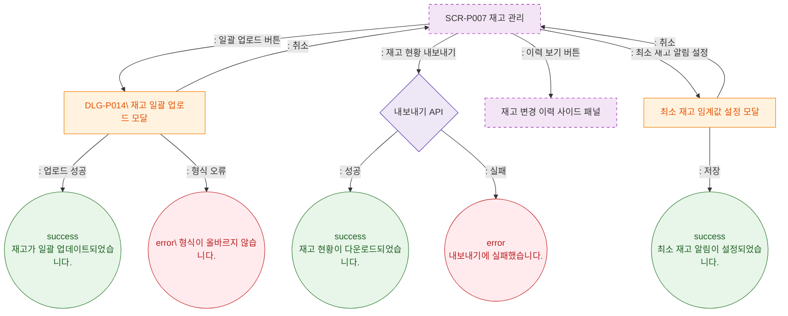

# F3 버튼 액션 플로우 — SCR-P007 재고 관리 🆕

## 다이어그램

## TC 후보

| TC ID | 타입 | Given | When | Then |
|-------|------|-------|------|------|
| TC-P007-F3-01 | positive | 유효한 CSV | 일괄 업로드 완료 | success 토스트 "재고가 일괄 업데이트되었습니다." |
| TC-P007-F3-02 | negative | 잘못된 CSV 형식 | 업로드 시도 | error 토스트 "CSV 형식이 올바르지 않습니다." |
| TC-P007-F3-03 | positive | 알림 설정 저장 | 확인 클릭 | success 토스트 "최소 재고 알림이 설정되었습니다." |
