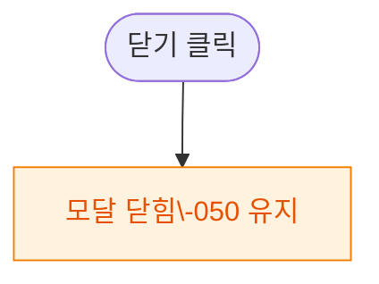

# M3 결과 분기 — DLG-050-001 락커 기록 모달

## 다이어그램

```mermaid
flowchart TD
    ACTION([닫기 클릭]) --> CLOSE[모달 닫힘\-050 유지]

    classDef modal fill:#FFF3E0,stroke:#F57C00,color:#E65100
    class CLOSE modal
```

## TC 후보

| TC ID | 타입 | Given | When | Then |
|-------|------|-------|------|------|
| - | - | - | - | - |
