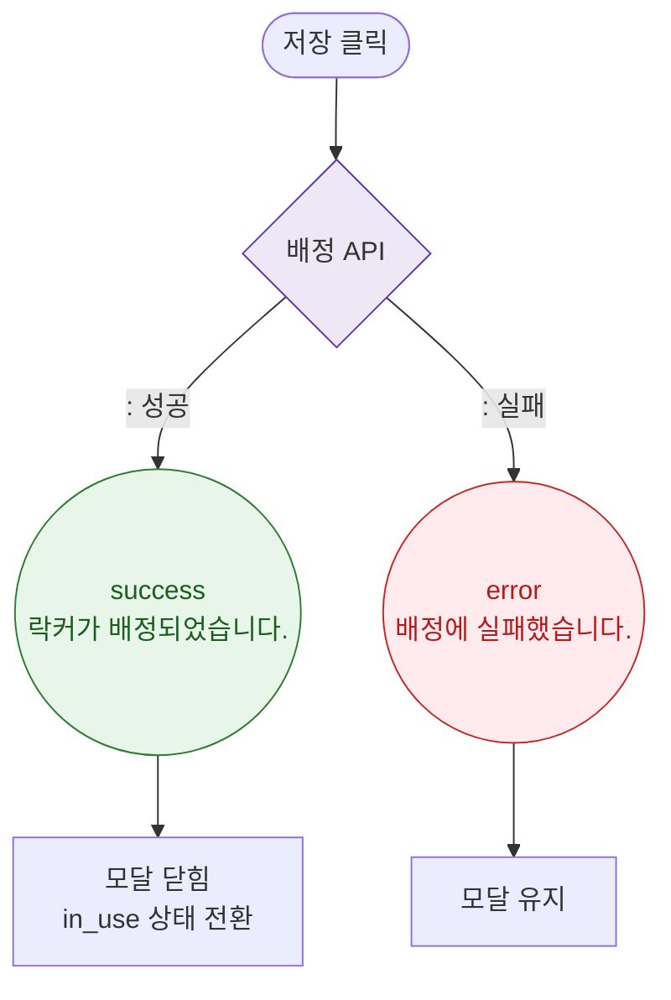

# M3 결과 분기 — DLG-050-004 개별 배정

## 다이어그램

```mermaid
flowchart TD
    ACTION([저장 클릭]) --> AssignAPI{배정 API}
    AssignAPI -->|": 성공"|SuccessToast((success\n락커가 배정되었습니다.))
    AssignAPI -->|": 실패"|ErrorToast((error\n배정에 실패했습니다.))
    SuccessToast --> CLOSE[모달 닫힘\nin_use 상태 전환]
    ErrorToast --> STAY[모달 유지]

    classDef success fill:#E8F5E9,stroke:#2E7D32,color:#1B5E20
    classDef error fill:#FFEBEE,stroke:#C62828,color:#B71C1C
    classDef system fill:#EDE7F6,stroke:#5E35B2
    class SuccessToast success
    class ErrorToast error
    class AssignAPI system
```

## TC 후보

| TC ID | 타입 | Given | When | Then |
|-------|------|-------|------|------|
| - | - | - | - | - |
