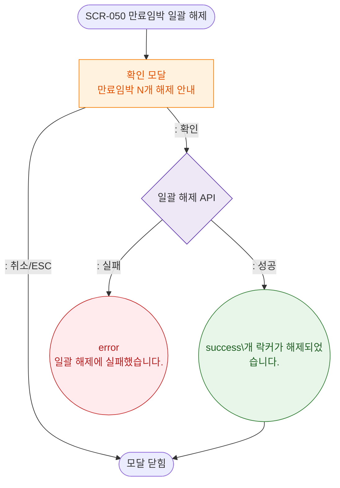

# M1 모달 생명주기 — DLG-050-007 일괄 해제 확인

## 다이어그램

```mermaid
flowchart TD
    TRIGGER([SCR-050 만료임박 일괄 해제]) --> OPEN[확인 모달\n만료임박 N개 해제 안내]
    OPEN -->|": 확인"|BulkRevokeAPI{일괄 해제 API}
    BulkRevokeAPI -->|": 성공"|SUCCESS((success\개 락커가 해제되었습니다.))
    BulkRevokeAPI -->|": 실패"|FAIL((error\n일괄 해제에 실패했습니다.))
    OPEN -->|": 취소/ESC"|CLOSED([모달 닫힘])
    SUCCESS --> CLOSED

    classDef modal fill:#FFF3E0,stroke:#F57C00,color:#E65100
    classDef success fill:#E8F5E9,stroke:#2E7D32,color:#1B5E20
    classDef error fill:#FFEBEE,stroke:#C62828,color:#B71C1C
    classDef system fill:#EDE7F6,stroke:#5E35B2
    class OPEN modal
    class SUCCESS success
    class FAIL error
    class BulkRevokeAPI system
```

## TC 후보

| TC ID | 타입 | Given | When | Then |
|-------|------|-------|------|------|
| - | positive | 만료임박 락커 존재 | 일괄 해제 확인 | N개 available 전환 |
