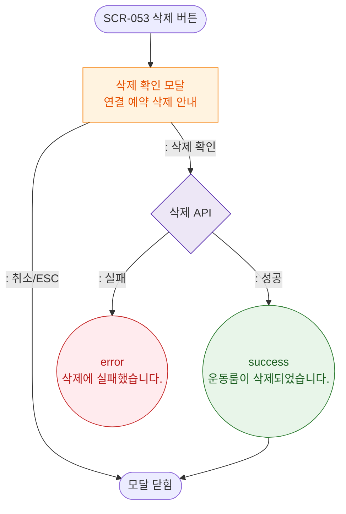

# M1 모달 생명주기 — DLG-053-002 룸 삭제 확인

## 다이어그램

```mermaid
flowchart TD
    TRIGGER([SCR-053 삭제 버튼]) --> OPEN[삭제 확인 모달\n연결 예약 삭제 안내]
    OPEN -->|": 삭제 확인"|DeleteAPI{삭제 API}
    DeleteAPI -->|": 성공"|SUCCESS((success\n운동룸이 삭제되었습니다.))
    DeleteAPI -->|": 실패"|FAIL((error\n삭제에 실패했습니다.))
    OPEN -->|": 취소/ESC"|CLOSED([모달 닫힘])
    SUCCESS --> CLOSED

    classDef modal fill:#FFF3E0,stroke:#F57C00,color:#E65100
    classDef success fill:#E8F5E9,stroke:#2E7D32,color:#1B5E20
    classDef error fill:#FFEBEE,stroke:#C62828,color:#B71C1C
    classDef system fill:#EDE7F6,stroke:#5E35B2
    class OPEN modal
    class SUCCESS success
    class FAIL error
    class DeleteAPI system
```

## TC 후보

| TC ID | 타입 | Given | When | Then |
|-------|------|-------|------|------|
| TC-053-005 | positive | 삭제 확인 모달 | 삭제 확인 클릭 | 운동룸 삭제, 목록 갱신 |
