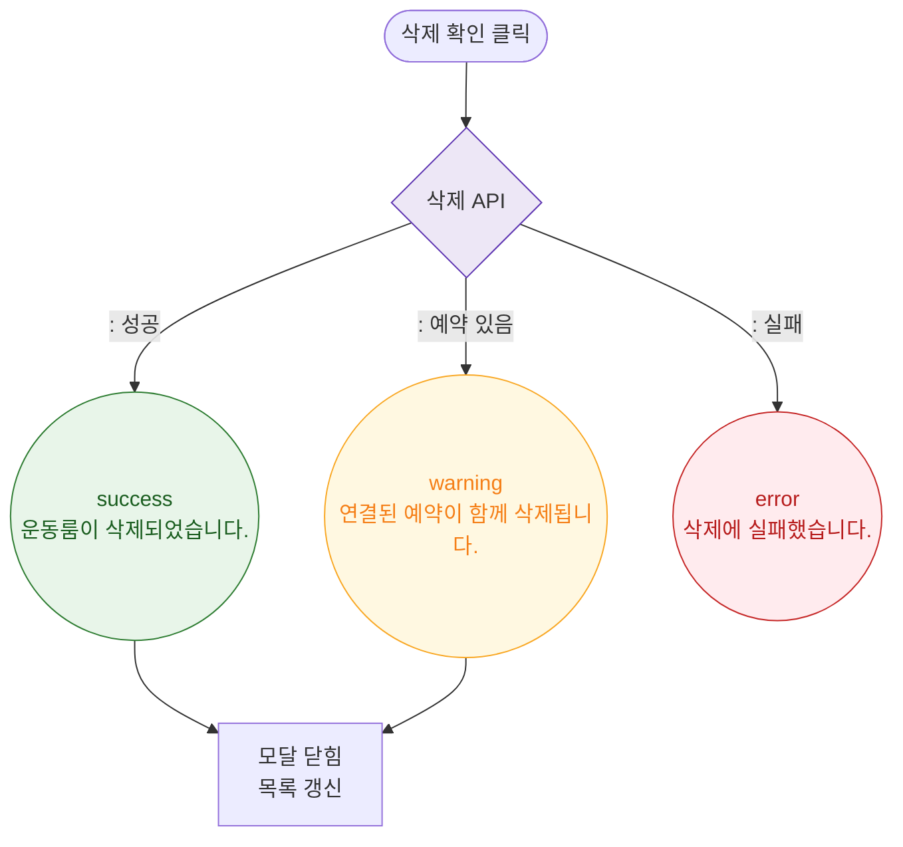

# M3 결과 분기 — DLG-053-002 룸 삭제 확인

## 다이어그램

```mermaid
flowchart TD
    ACTION([삭제 확인 클릭]) --> DeleteAPI{삭제 API}
    DeleteAPI -->|": 성공"|SuccessToast((success\n운동룸이 삭제되었습니다.))
    DeleteAPI -->|": 예약 있음"|WarnToast((warning\n연결된 예약이 함께 삭제됩니다.))
    DeleteAPI -->|": 실패"|ErrorToast((error\n삭제에 실패했습니다.))
    SuccessToast & WarnToast --> CLOSE[모달 닫힘\n목록 갱신]

    classDef success fill:#E8F5E9,stroke:#2E7D32,color:#1B5E20
    classDef warning fill:#FFF8E1,stroke:#F9A825,color:#F57F17
    classDef error fill:#FFEBEE,stroke:#C62828,color:#B71C1C
    classDef system fill:#EDE7F6,stroke:#5E35B2
    class SuccessToast success
    class WarnToast warning
    class ErrorToast error
    class DeleteAPI system
```

## TC 후보

| TC ID | 타입 | Given | When | Then |
|-------|------|-------|------|------|
| - | - | - | - | - |
