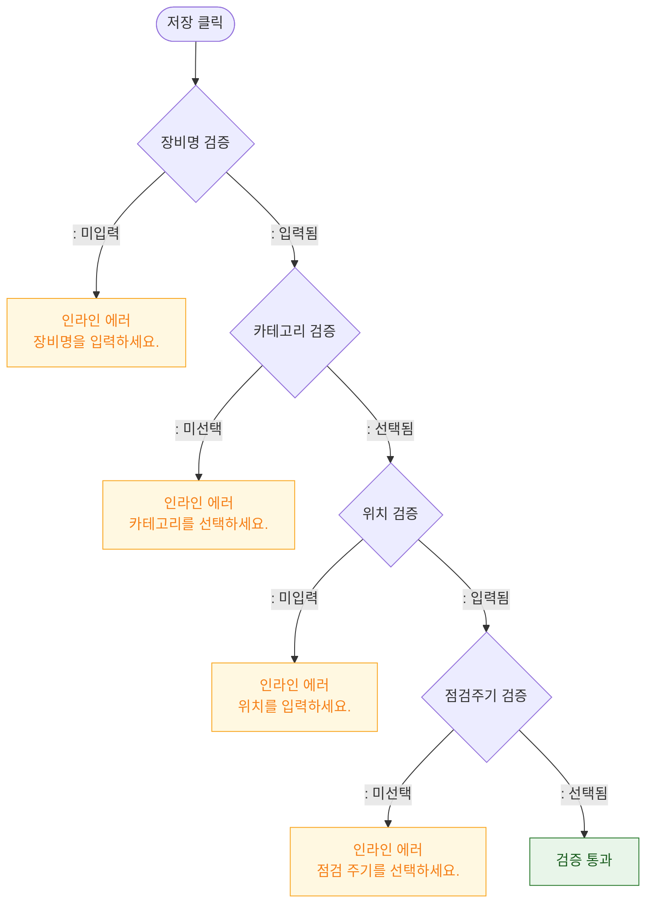

# M2 필드 검증 — DLG-056-001 장비 등록/수정 🆕

## 다이어그램

## TC 후보

| TC ID | 타입 | Given | When | Then |
|-------|------|-------|------|------|
| TC-056-003 | negative | 장비명 미입력 | 저장 클릭 | 인라인 에러 "장비명을 입력하세요." |
