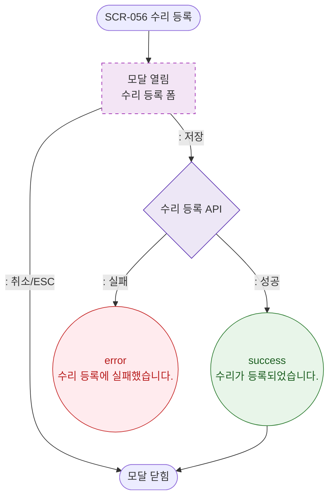

# M1 모달 생명주기 — DLG-056-003 수리 등록 🆕

## 다이어그램

```mermaid
flowchart TD
    TRIGGER([SCR-056 수리 등록]) --> OPEN[모달 열림\n수리 등록 폼]
    OPEN -->|": 저장"|SaveAPI{수리 등록 API}
    SaveAPI -->|": 성공"|SUCCESS((success\n수리가 등록되었습니다.))
    SaveAPI -->|": 실패"|FAIL((error\n수리 등록에 실패했습니다.))
    OPEN -->|": 취소/ESC"|CLOSED([모달 닫힘])
    SUCCESS --> CLOSED

    classDef newFeature fill:#F3E5F5,stroke:#9C27B0,stroke-dasharray:5 5
    classDef success fill:#E8F5E9,stroke:#2E7D32,color:#1B5E20
    classDef error fill:#FFEBEE,stroke:#C62828,color:#B71C1C
    classDef system fill:#EDE7F6,stroke:#5E35B2
    class OPEN newFeature
    class SUCCESS success
    class FAIL error
    class SaveAPI system
```

## TC 후보

| TC ID | 타입 | Given | When | Then |
|-------|------|-------|------|------|
| - | positive | 수리 등록 모달 | 저장 클릭 | 수리 이력 추가, 장비 상태 수리중 전환 |
