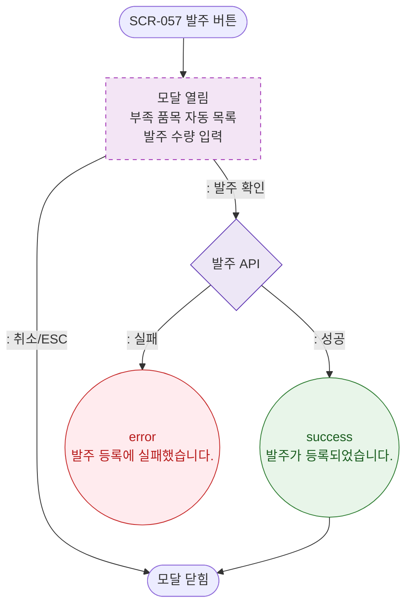

# M1 모달 생명주기 — DLG-057-003 발주 생성 🆕

## 다이어그램

```mermaid
flowchart TD
    TRIGGER([SCR-057 발주 버튼]) --> OPEN[모달 열림\n부족 품목 자동 목록\n발주 수량 입력]
    OPEN -->|": 발주 확인"|OrderAPI{발주 API}
    OrderAPI -->|": 성공"|SUCCESS((success\n발주가 등록되었습니다.))
    OrderAPI -->|": 실패"|FAIL((error\n발주 등록에 실패했습니다.))
    OPEN -->|": 취소/ESC"|CLOSED([모달 닫힘])
    SUCCESS --> CLOSED

    classDef newFeature fill:#F3E5F5,stroke:#9C27B0,stroke-dasharray:5 5
    classDef success fill:#E8F5E9,stroke:#2E7D32,color:#1B5E20
    classDef error fill:#FFEBEE,stroke:#C62828,color:#B71C1C
    classDef system fill:#EDE7F6,stroke:#5E35B2
    class OPEN newFeature
    class SUCCESS success
    class FAIL error
    class OrderAPI system
```

## TC 후보

| TC ID | 타입 | Given | When | Then |
|-------|------|-------|------|------|
| - | positive | 발주 모달 | 발주 확인 클릭 | 발주 이력 추가 |
