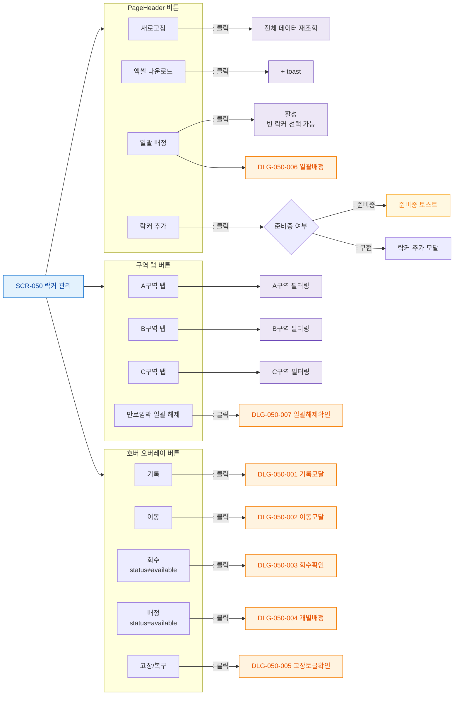

# F3 버튼/액션 매핑 — SCR-050 락커 관리

## 1. 목적
화면 내 모든 버튼을 노드화하여 버튼별 동작 TC의 원천으로 활용한다.

## 2. 전제조건
- SCR-050 정상 진입 상태

## 3. 다이어그램

## 4. 엣지 설명

| 버튼 | 동작 |
|------|------|
| 새로고침 | 전체 데이터 재조회 |
| 엑셀 다운로드 | () + toast |
| 일괄 배정 | 활성 → DLG-050-006 |
| 락커 추가 | 준비중 toast 또는 추가 모달 |
| 구역 탭 | 해당 구역 필터링 |
| 만료임박 일괄해제 | DLG-050-007 |
| 호버 오버레이 버튼 | 각 DLG 트리거 |
