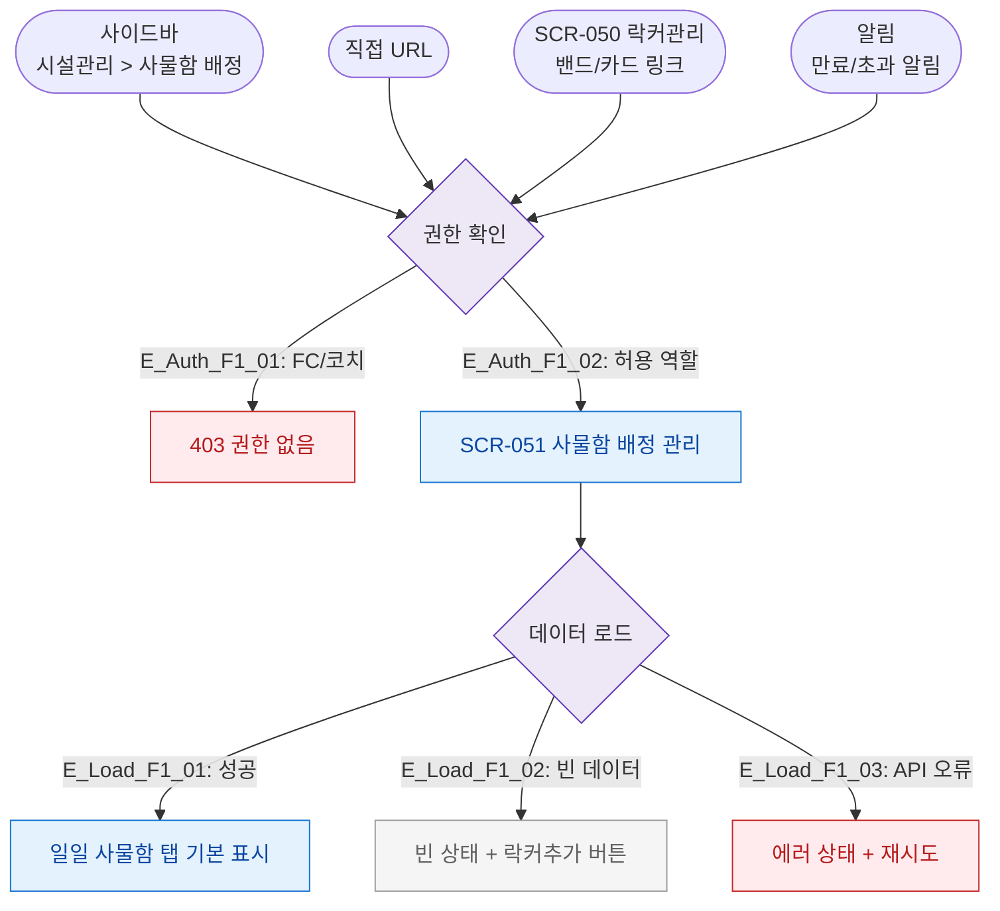

# F1 진입 플로우 — SCR-051 사물함 배정 관리

## 1. 목적
사물함 배정 관리 화면(``)으로 진입 가능한 모든 경로를 정의한다.

## 2. 전제조건
- 로그인 상태
- 역할: 슈퍼관리자/센터장/매니저/스태프

## 3. 다이어그램

## 4. 엣지 설명

| 출발 | 도착 | 조건 |
|------|------|------|
| 사이드바 | 권한확인 | 사물함 배정 메뉴 클릭 |
| 직접URL | 권한확인 | |
| 권한확인 | Blocked | FC/코치 |
| 권한확인 | SCR-051 | 허용 역할 |
| 데이터로드 | 결과 | API 응답별 |
