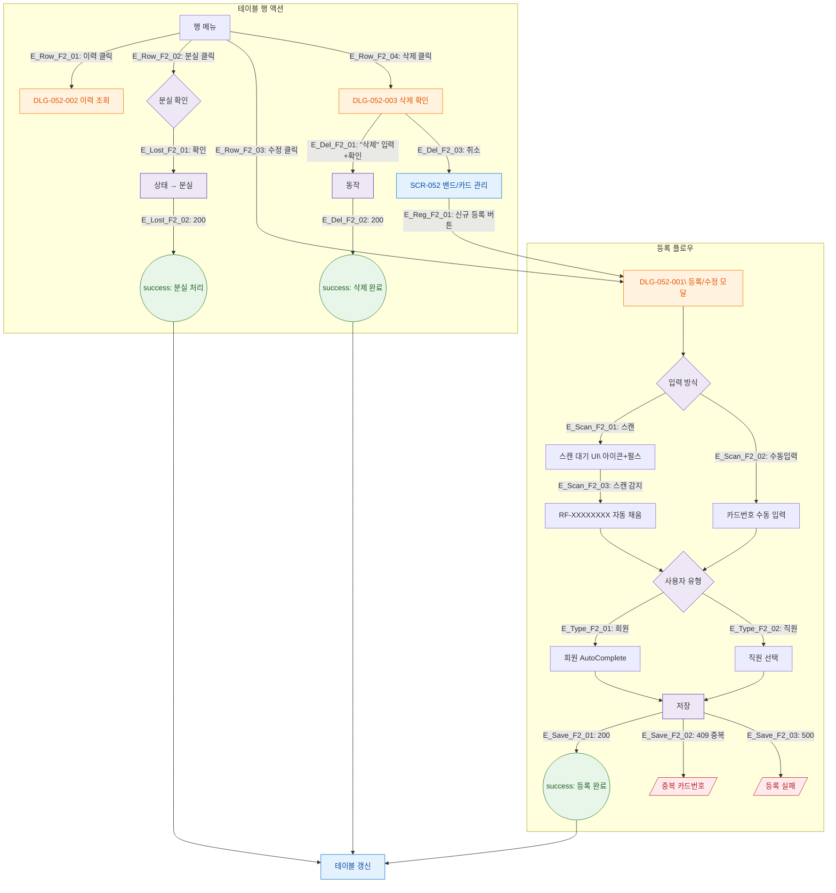

# F2 메인 인터랙션 플로우 — SCR-052 밴드/카드 관리

## 1. 목적
RFID 카드 등록·수정·분실·삭제·이력조회의 Happy Path와 IoT 페어링 분기를 정의한다.

## 2. 전제조건
- SCR-052 정상 진입

## 3. 다이어그램

## 4. 엣지 설명

| 출발 | 도착 | 조건 |
|------|------|------|
| 스캔모드 | 입력방식 | 스캔/수동 선택 |
| 스캔대기 | 자동채움 | RFID 스캔 감지 |
| 저장 | 결과 | API 응답별 |
| 분실확인 | API | 확인 클릭 |
| 삭제확인 | API/취소 | 일치 |
