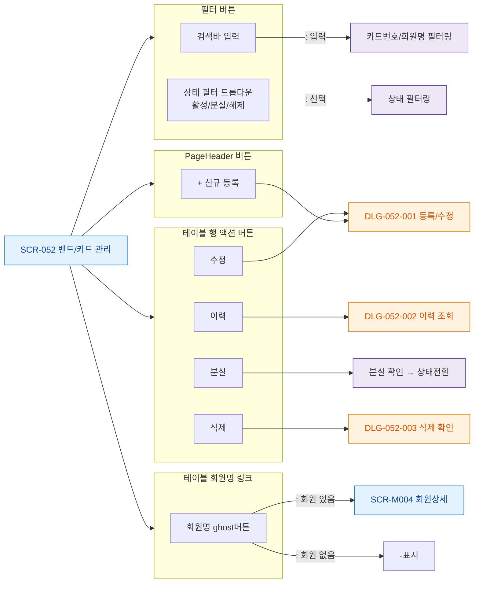

# F3 버튼/액션 매핑 — SCR-052 밴드/카드 관리

## 1. 목적
화면 내 모든 버튼을 노드화한다.

## 2. 다이어그램

## 4. 엣지 설명

| 버튼 | 동작 |
|------|------|
| 신규 등록 | DLG-052-001 열기 |
| 검색/필터 | 테이블 필터링 |
| 행 액션 | DLG 또는 직접 처리 |
| 회원명 링크 | 회원상세 이동 |
