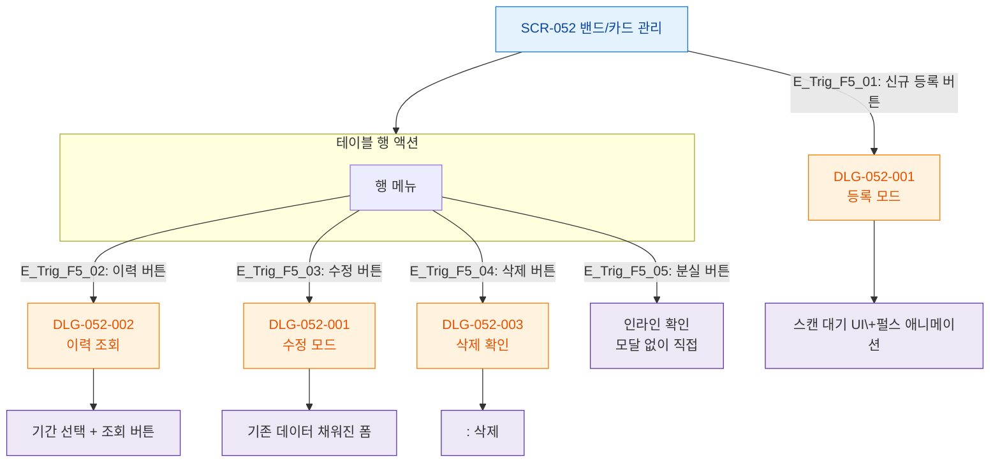

# F5 모달 트리거 트리 — SCR-052 밴드/카드 관리

## 1. 목적
SCR-052에서 트리거되는 모든 DLG의 진입 경로를 정의한다.

## 2. 다이어그램

## 4. 엣지 설명

| 트리거 | DLG | 모드 |
|--------|-----|------|
| 신규 등록 버튼 | DLG-052-001 | 등록 모드 |
| 행 > 이력 | DLG-052-002 | 조회 |
| 행 > 수정 | DLG-052-001 | 수정 모드 |
| 행 > 삭제 | DLG-052-003 | 삭제 확인 |
