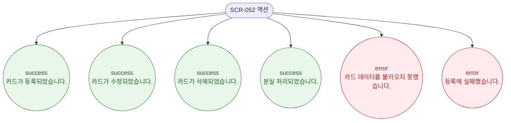

# F9 토스트/피드백 플로우 — SCR-052 밴드/카드 관리

## 다이어그램

## TC 후보

| TC ID | 타입 | Given | When | Then |
|-------|------|-------|------|------|
| TC-052-001 | positive | 카드 등록 성공 | 저장 클릭 | success 토스트 "카드가 등록되었습니다." |
| TC-052-004 | positive | 분실 처리 성공 | 분실 버튼 클릭 | success 토스트 "분실 처리되었습니다." |
| TC-052-005 | positive | 카드 삭제 성공 | 삭제 확인 | success 토스트 "카드가 삭제되었습니다." |
