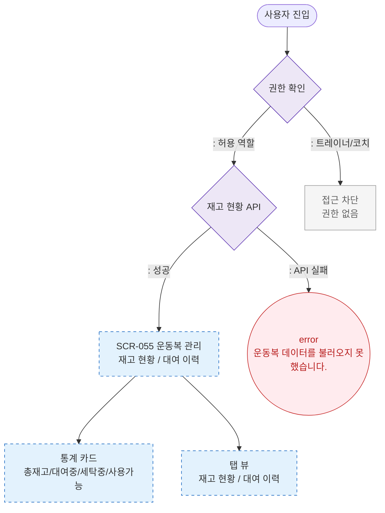

# F1 진입 플로우 — SCR-055 운동복 관리

## 다이어그램

```mermaid
flowchart TD
    START([사용자 진입]) --> AuthCheck{권한 확인}

    AuthCheck -->|": 허용 역할"|LoadAPI{재고 현황 API}
    AuthCheck -->|": 트레이너/코치"|Blocked[접근 차단\n권한 없음]

    LoadAPI -->|": 성공"|SCR_055[SCR-055 운동복 관리\n재고 현황 / 대여 이력]
    LoadAPI -->|": API 실패"|ErrToast((error\n운동복 데이터를 불러오지 못했습니다.))

    SCR_055 --> StatCards[통계 카드\n총재고/대여중/세탁중/사용가능]
    SCR_055 --> TabView[탭 뷰\n재고 현황 / 대여 이력]

    classDef screen fill:#E3F2FD,stroke:#1565C0,stroke-dasharray:5 5
    classDef error fill:#FFEBEE,stroke:#C62828,color:#B71C1C
    classDef rbacBlocked fill:#F5F5F5,stroke:#9E9E9E,color:#616161
    classDef system fill:#EDE7F6,stroke:#5E35B2
    class SCR_055,StatCards,TabView screen
    class ErrToast error
    class Blocked rbacBlocked
    class AuthCheck,LoadAPI system
```

## TC 후보

| TC ID | 타입 | Given | When | Then |
|-------|------|-------|------|------|
| TC-055-001 | positive | 프론트 로그인 | SCR-055 진입 | 재고 현황 테이블 표시 |
