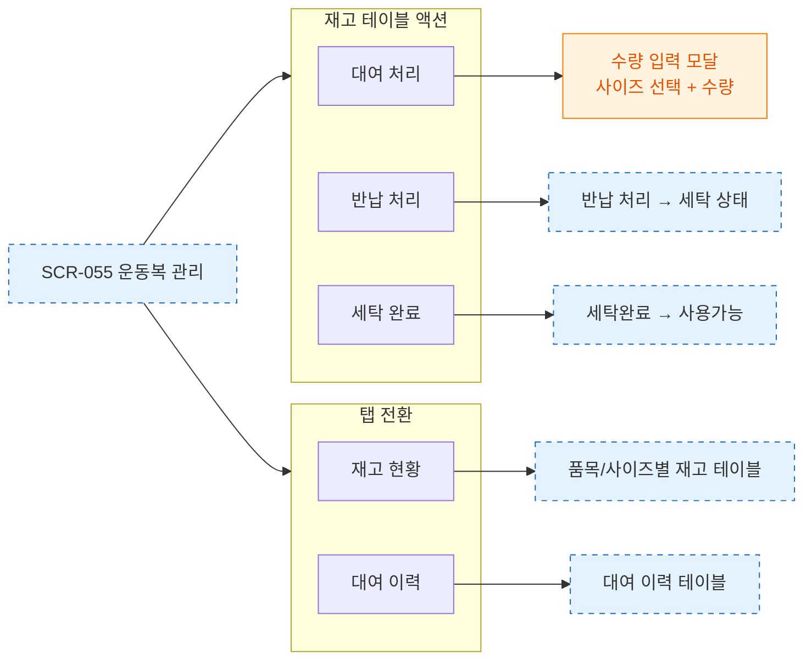

# F3 버튼 액션 플로우 — SCR-055 운동복 관리

## 다이어그램

## TC 후보

| TC ID | 타입 | Given | When | Then |
|-------|------|-------|------|------|
| TC-055-002 | positive | 재고 있음 | 대여 처리 클릭 | 수량 입력 모달 표시 |
| TC-055-004 | positive | 대여중 항목 | 반납 처리 클릭 | 세탁 상태로 전환 |
