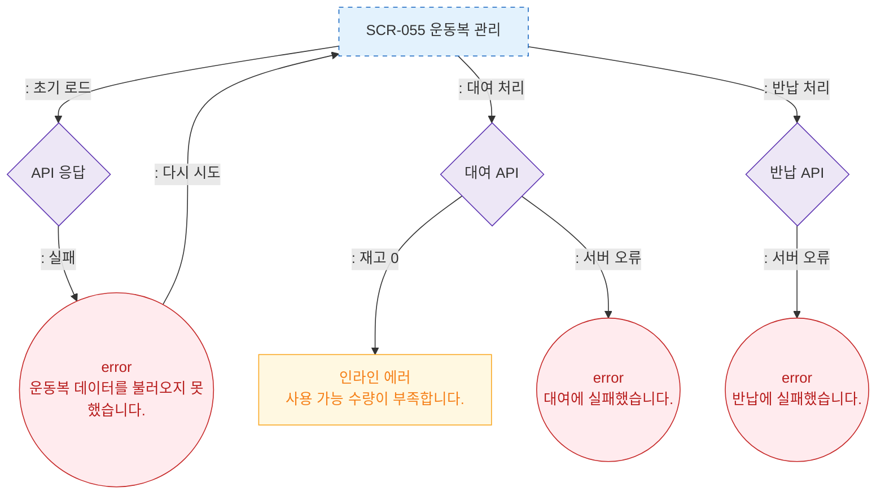

# F8 에러/예외/복구 플로우 — SCR-055 운동복 관리

## 다이어그램

## TC 후보

| TC ID | 타입 | Given | When | Then |
|-------|------|-------|------|------|
| TC-055-003 | negative | 사용가능 재고 0 | 대여 시도 | 인라인 에러 "사용 가능 수량이 부족합니다." |
