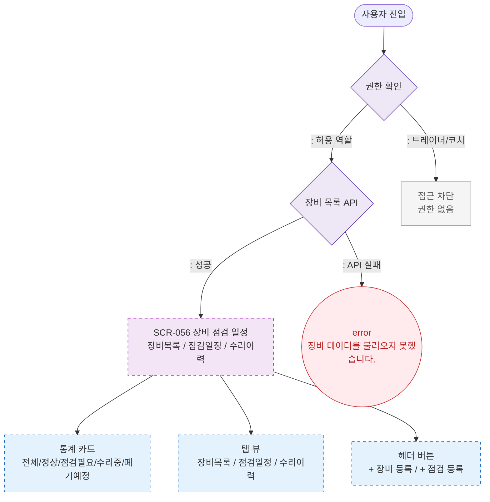

# F1 진입 플로우 — SCR-056 장비 점검 일정 🆕

## 다이어그램

```mermaid
flowchart TD
    START([사용자 진입]) --> AuthCheck{권한 확인}

    AuthCheck -->|": 허용 역할"|LoadAPI{장비 목록 API}
    AuthCheck -->|": 트레이너/코치"|Blocked[접근 차단\n권한 없음]

    LoadAPI -->|": 성공"|SCR_056[SCR-056 장비 점검 일정\n장비목록 / 점검일정 / 수리이력]
    LoadAPI -->|": API 실패"|ErrToast((error\n장비 데이터를 불러오지 못했습니다.))

    SCR_056 --> StatCards[통계 카드\n전체/정상/점검필요/수리중/폐기예정]
    SCR_056 --> TabView[탭 뷰\n장비목록 / 점검일정 / 수리이력]
    SCR_056 --> HeaderBtns[헤더 버튼\n+ 장비 등록 / + 점검 등록]

    classDef screen fill:#E3F2FD,stroke:#1565C0,stroke-dasharray:5 5
    classDef newFeature fill:#F3E5F5,stroke:#9C27B0,stroke-dasharray:5 5
    classDef error fill:#FFEBEE,stroke:#C62828,color:#B71C1C
    classDef rbacBlocked fill:#F5F5F5,stroke:#9E9E9E,color:#616161
    classDef system fill:#EDE7F6,stroke:#5E35B2
    class SCR_056 newFeature
    class StatCards,TabView,HeaderBtns screen
    class ErrToast error
    class Blocked rbacBlocked
    class AuthCheck,LoadAPI system
```

## TC 후보

| TC ID | 타입 | Given | When | Then |
|-------|------|-------|------|------|
| TC-056-001 | positive | 매니저 로그인 | SCR-056 진입 | 장비 목록 탭 표시 |
