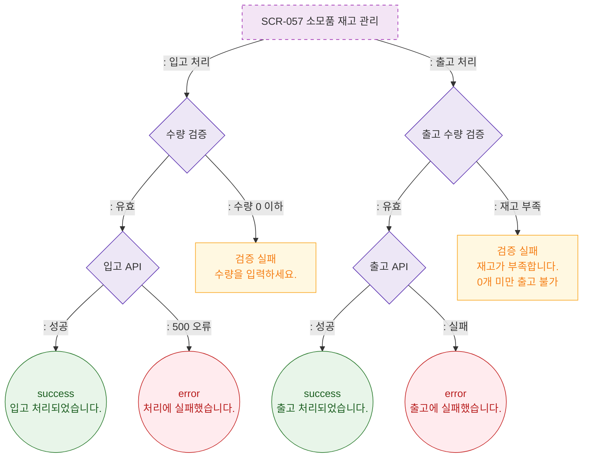

# F2 메인 인터랙션 플로우 — SCR-057 소모품 재고 관리 🆕

## 다이어그램

## TC 후보

| TC ID | 타입 | Given | When | Then |
|-------|------|-------|------|------|
| TC-057-002 | positive | 수량 입력 | 입고 처리 | success 토스트, 현재고 증가 |
| TC-057-003 | positive | 현재고 > 출고 수량 | 출고 처리 | success 토스트, 현재고 감소 |
| TC-057-004 | negative | 현재고 < 출고 수량 | 출고 시도 | 검증 실패 "재고가 부족합니다." |
