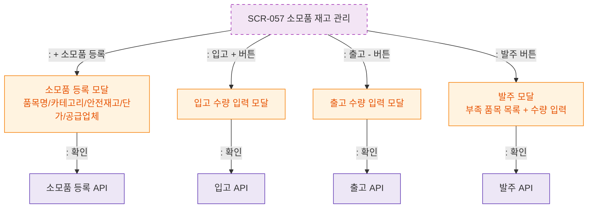

# F5 모달 트리거 트리 — SCR-057 소모품 재고 관리 🆕

## 다이어그램

## TC 후보

| TC ID | 타입 | Given | When | Then |
|-------|------|-------|------|------|
| TC-057-002 | positive | SCR-057 | 입고 + 클릭 | 입고 수량 입력 모달 열림 |
| TC-057-003 | positive | SCR-057 | 출고 - 클릭 | 출고 수량 입력 모달 열림 |
