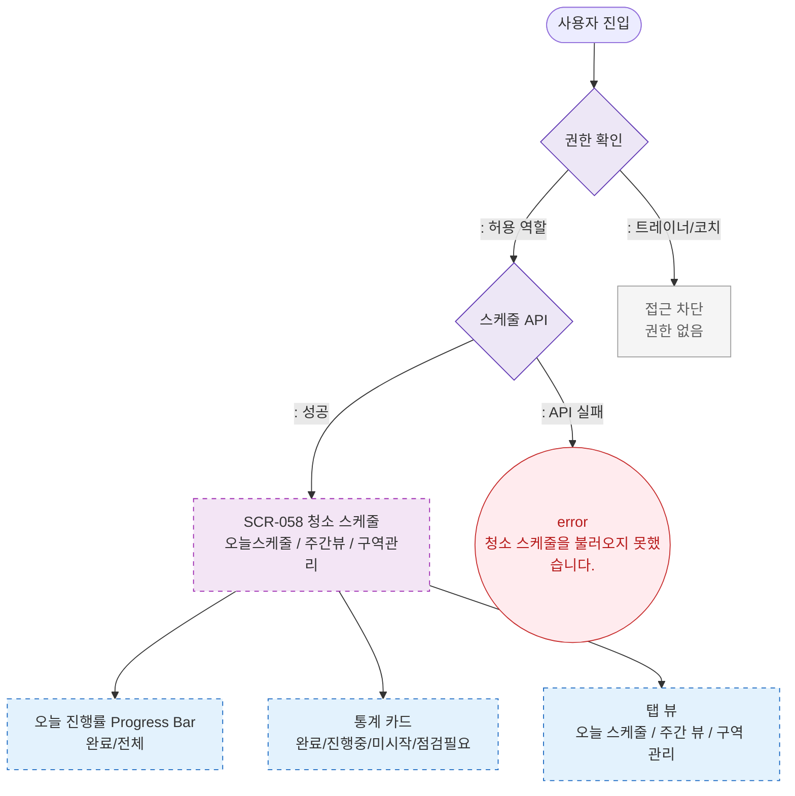

# F1 진입 플로우 — SCR-058 청소 스케줄 🆕

## 다이어그램

## TC 후보

| TC ID | 타입 | Given | When | Then |
|-------|------|-------|------|------|
| TC-058-001 | positive | 프론트 로그인 | SCR-058 진입 | 오늘 스케줄 테이블 + 진행률 표시 |
