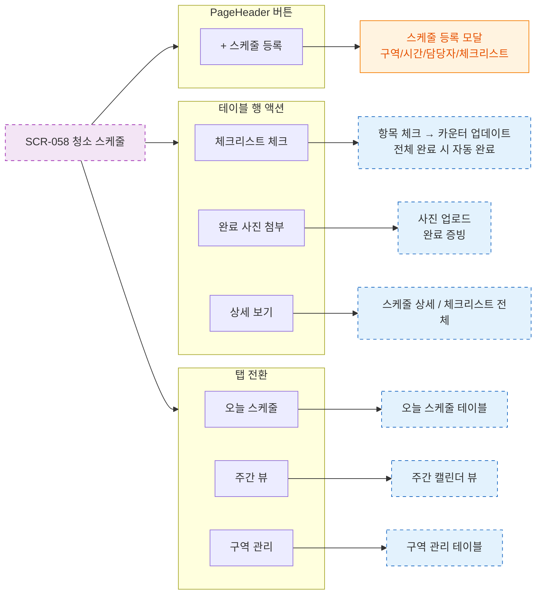

# F3 버튼 액션 플로우 — SCR-058 청소 스케줄 🆕

## 다이어그램

## TC 후보

| TC ID | 타입 | Given | When | Then |
|-------|------|-------|------|------|
| TC-058-002 | positive | 체크리스트 전체 완료 | 마지막 항목 체크 | 완료 상태 자동 전환 |
| TC-058-005 | positive | SCR-058 | + 스케줄 등록 클릭 | 스케줄 등록 모달 열림 |
