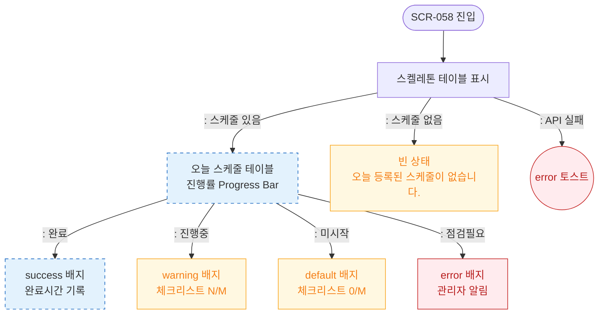

# F6 상태별 화면 플로우 — SCR-058 청소 스케줄 🆕

## 다이어그램

## TC 후보

| TC ID | 타입 | Given | When | Then |
|-------|------|-------|------|------|
| TC-058-006 | positive | 상태 필터 "미시작" | 선택 | 미시작 항목만 표시, default 배지 |
