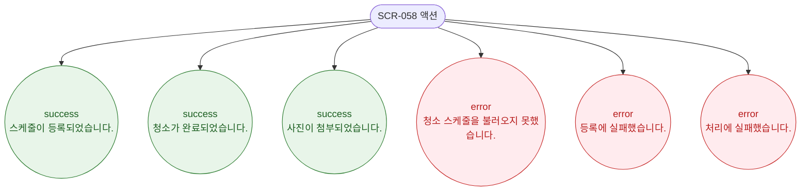

# F9 토스트/피드백 플로우 — SCR-058 청소 스케줄 🆕

## 다이어그램

## TC 후보

| TC ID | 타입 | Given | When | Then |
|-------|------|-------|------|------|
| TC-058-002 | positive | 체크리스트 전체 완료 | 마지막 항목 체크 | success 토스트 "청소가 완료되었습니다." |
| TC-058-005 | positive | 스케줄 등록 성공 | 저장 클릭 | success 토스트 "스케줄이 등록되었습니다." |
| TC-058-008 | positive | 완료 사진 업로드 | 파일 선택 후 업로드 | success 토스트 "사진이 첨부되었습니다." |
