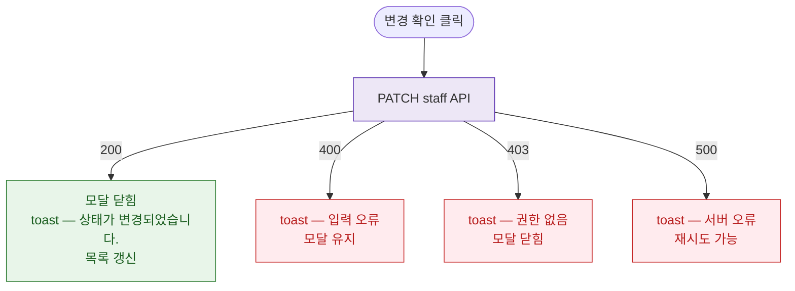

## 3. 다이어그램

```mermaid
flowchart TD
  SUBMIT([변경 확인 클릭])
  SUBMIT --> API[PATCH staff API]

  API -->|200|SUCCESS[모달 닫힘\ntoast — 상태가 변경되었습니다.\n목록 갱신]
  API -->|400|ERR_400[toast — 입력 오류\n모달 유지]
  API -->|403|ERR_403[toast — 권한 없음\n모달 닫힘]
  API -->|500|ERR_500[toast — 서버 오류\n재시도 가능]

  classDef success fill:#E8F5E9,stroke:#2E7D32,color:#1B5E20
  classDef error fill:#FFEBEE,stroke:#C62828,color:#B71C1C
  classDef system fill:#EDE7F6,stroke:#5E35B2

  class SUCCESS success
  class ERR_400,ERR_403,ERR_500 error
  class API system
```
