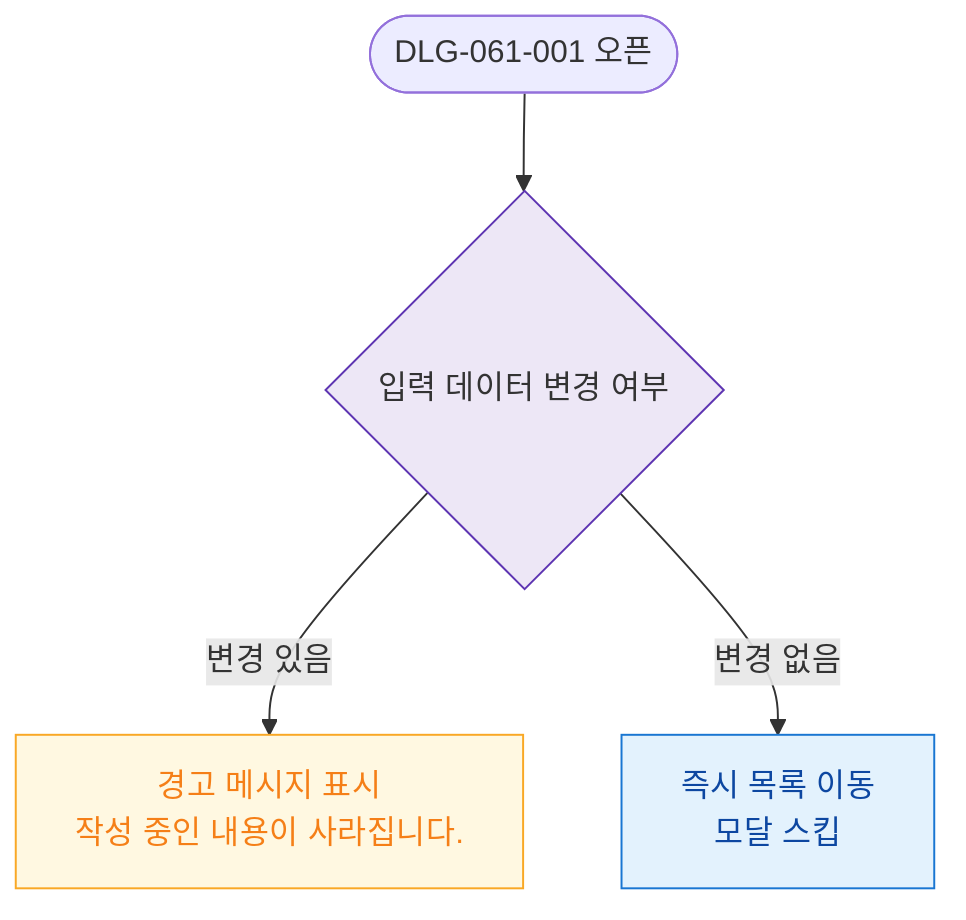

## 3. 다이어그램

```mermaid
flowchart TD
  OPEN([DLG-061-001 오픈])
  OPEN --> CHECK{입력 데이터 변경 여부}

  CHECK -->|변경 있음|SHOW_WARNING[경고 메시지 표시\n작성 중인 내용이 사라집니다.]
  CHECK -->|변경 없음|DIRECT_CLOSE[즉시 목록 이동\n모달 스킵]

  classDef warning fill:#FFF8E1,stroke:#F9A825,color:#F57F17
  classDef system fill:#EDE7F6,stroke:#5E35B2
  classDef screen fill:#E3F2FD,stroke:#1976D2,color:#0D47A1

  class SHOW_WARNING warning
  class CHECK system
  class DIRECT_CLOSE screen
```
