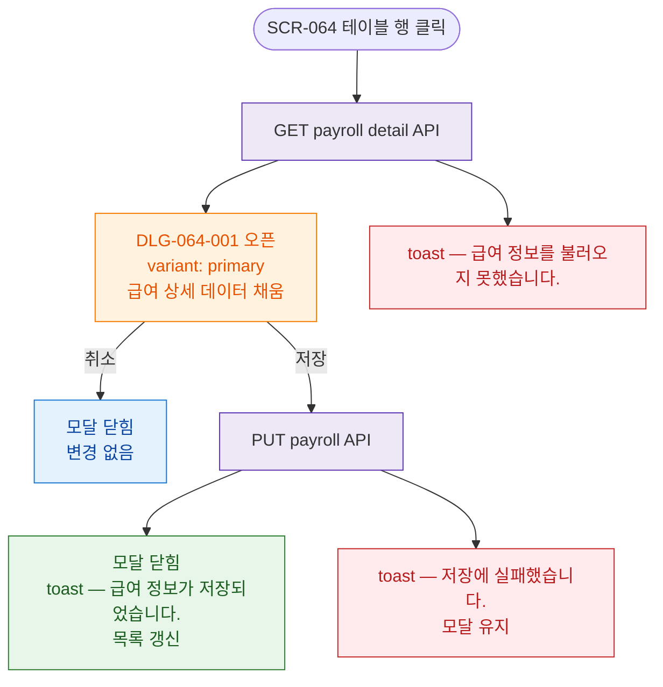

## 3. 다이어그램

```mermaid
flowchart TD
  TRIGGER([SCR-064 테이블 행 클릭])
  TRIGGER --> LOAD[GET payroll detail API]
  LOAD --> OPEN[DLG-064-001 오픈\nvariant: primary\n급여 상세 데이터 채움]
  LOAD --> ERR_LOAD[toast — 급여 정보를 불러오지 못했습니다.]

  OPEN -->|취소|CLOSE_CANCEL[모달 닫힘\n변경 없음]
  OPEN -->|저장|SUBMIT[PUT payroll API]

  SUBMIT --> CLOSE_OK[모달 닫힘\ntoast — 급여 정보가 저장되었습니다.\n목록 갱신]
  SUBMIT --> ERR[toast — 저장에 실패했습니다.\n모달 유지]

  classDef screen fill:#E3F2FD,stroke:#1976D2,color:#0D47A1
  classDef modal fill:#FFF3E0,stroke:#F57C00,color:#E65100
  classDef success fill:#E8F5E9,stroke:#2E7D32,color:#1B5E20
  classDef error fill:#FFEBEE,stroke:#C62828,color:#B71C1C
  classDef system fill:#EDE7F6,stroke:#5E35B2

  class OPEN modal
  class CLOSE_OK success
  class ERR,ERR_LOAD error
  class SUBMIT,LOAD system
  class CLOSE_CANCEL screen
```
