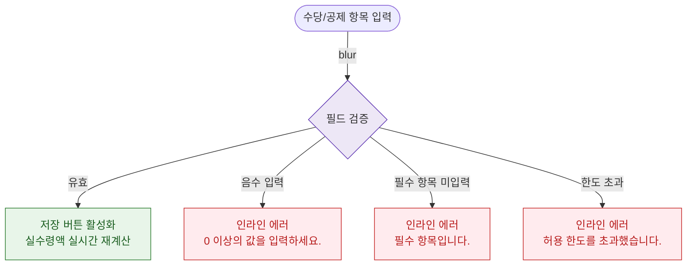

## 3. 다이어그램

```mermaid
flowchart TD
  INPUT([수당/공제 항목 입력])
  INPUT -->|blur|VALIDATE{필드 검증}

  VALIDATE -->|유효|VALID[저장 버튼 활성화\n실수령액 실시간 재계산]
  VALIDATE -->|음수 입력|ERR_NEG[인라인 에러\n0 이상의 값을 입력하세요.]
  VALIDATE -->|필수 항목 미입력|ERR_EMPTY[인라인 에러\n필수 항목입니다.]
  VALIDATE -->|한도 초과|ERR_EXCEED[인라인 에러\n허용 한도를 초과했습니다.]

  classDef success fill:#E8F5E9,stroke:#2E7D32,color:#1B5E20
  classDef error fill:#FFEBEE,stroke:#C62828,color:#B71C1C
  classDef system fill:#EDE7F6,stroke:#5E35B2

  class VALID success
  class ERR_NEG,ERR_EMPTY,ERR_EXCEED error
  class VALIDATE system
```
