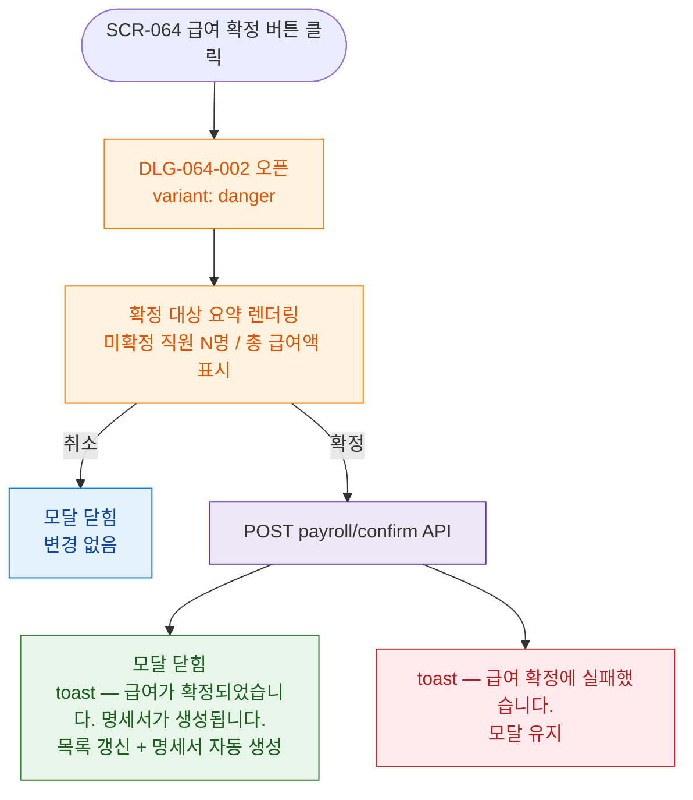

## 3. 다이어그램

```mermaid
flowchart TD
  TRIGGER([SCR-064 급여 확정 버튼 클릭])
  TRIGGER --> OPEN[DLG-064-002 오픈\nvariant: danger]

  OPEN --> RENDER[확정 대상 요약 렌더링\n미확정 직원 N명 / 총 급여액 표시]

  RENDER -->|취소|CLOSE_CANCEL[모달 닫힘\n변경 없음]
  RENDER -->|확정|SUBMIT[POST payroll/confirm API]

  SUBMIT --> CLOSE_OK[모달 닫힘\ntoast — 급여가 확정되었습니다. 명세서가 생성됩니다.\n목록 갱신 + 명세서 자동 생성]
  SUBMIT --> ERR[toast — 급여 확정에 실패했습니다.\n모달 유지]

  classDef screen fill:#E3F2FD,stroke:#1976D2,color:#0D47A1
  classDef modal fill:#FFF3E0,stroke:#F57C00,color:#E65100
  classDef success fill:#E8F5E9,stroke:#2E7D32,color:#1B5E20
  classDef error fill:#FFEBEE,stroke:#C62828,color:#B71C1C
  classDef system fill:#EDE7F6,stroke:#5E35B2

  class OPEN,RENDER modal
  class CLOSE_OK success
  class ERR error
  class SUBMIT system
  class CLOSE_CANCEL screen
```
