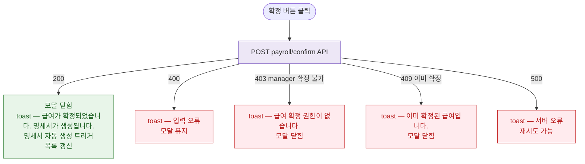

## 3. 다이어그램

```mermaid
flowchart TD
  SUBMIT([확정 버튼 클릭])
  SUBMIT --> API[POST payroll/confirm API]

  API -->|200|SUCCESS[모달 닫힘\ntoast — 급여가 확정되었습니다. 명세서가 생성됩니다.\n명세서 자동 생성 트리거\n목록 갱신]
  API -->|400|ERR_400[toast — 입력 오류\n모달 유지]
  API -->|403 manager 확정 불가|ERR_403[toast — 급여 확정 권한이 없습니다.\n모달 닫힘]
  API -->|409 이미 확정|ERR_409[toast — 이미 확정된 급여입니다.\n모달 닫힘]
  API -->|500|ERR_500[toast — 서버 오류\n재시도 가능]

  classDef success fill:#E8F5E9,stroke:#2E7D32,color:#1B5E20
  classDef error fill:#FFEBEE,stroke:#C62828,color:#B71C1C
  classDef system fill:#EDE7F6,stroke:#5E35B2

  class SUCCESS success
  class ERR_400,ERR_403,ERR_409,ERR_500 error
  class API system
```
