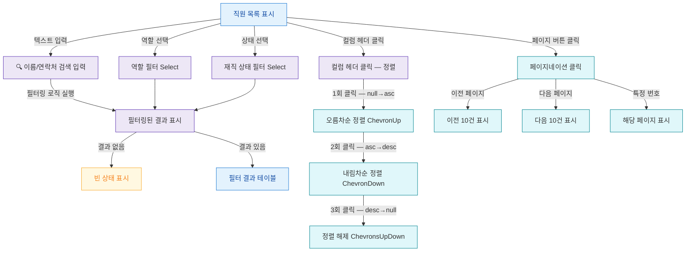

## 1. 목적

SCR-060의 필터/검색/정렬/페이지네이션 조작 흐름을 명세한다. 쿼리 TC 원천.

## 2. 전제조건

- SCR-060 진입 완료, 직원 목록 표시 상태이다.

## 3. 다이어그램

## 4. 엣지 설명 테이블

| 출발 | 도착 | 라벨 / 조건 |
|------|------|-------------|
| 목록 | 검색 입력 | 검색창 텍스트 입력 |
| 검색 입력 | 필터 결과 | 이름 or 연락처 포함 필터링 |
| 목록 | 역할 필터 | 역할 Select 변경 |
| 목록 | 상태 필터 | 재직 상태 Select 변경 |
| 정렬 | 오름차순 | 컬럼 헤더 1회 클릭 |
| 오름차순 | 내림차순 | 컬럼 헤더 2회 클릭 |
| 내림차순 | 정렬 해제 | 컬럼 헤더 3회 클릭 |
| 페이지 | 이전 | 이전 버튼 |
| 페이지 | 다음 | 다음 버튼 |
| 페이지 | 특정 페이지 | 번호 클릭 |
