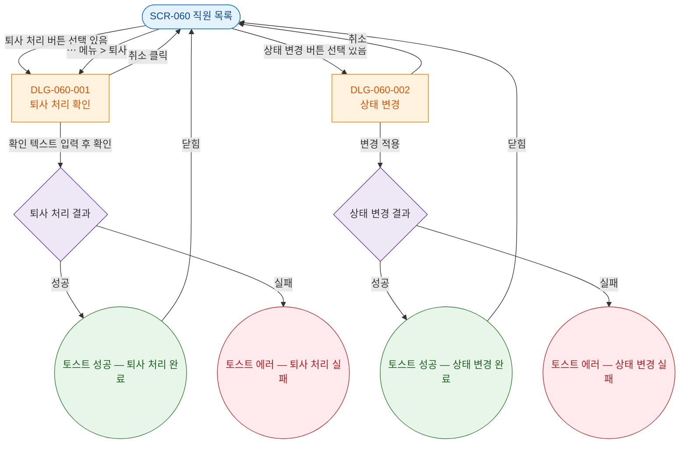

## 1. 목적

SCR-060에서 발생하는 모든 모달/다이얼로그 트리거 경로를 명세한다. 모달 진입 TC 원천.

## 2. 전제조건

- SCR-060 진입 완료 상태이다.

## 3. 다이어그램

## 4. 엣지 설명 테이블

| 출발 | 도착 | 라벨 / 조건 |
|------|------|-------------|
| SCR-060 | DLG-060-001 | 퇴사 처리 버튼 (선택 있음) |
| SCR-060 | DLG-060-001 | ⋯ 메뉴 > 퇴사 |
| SCR-060 | DLG-060-002 | 상태 변경 버튼 (선택 있음) |
| DLG-060-001 | SCR-060 | 취소 클릭 |
| DLG-060-001 | 처리 결과 | 확인 텍스트 입력 후 확인 |
| DLG-060-002 | SCR-060 | 취소 |
| DLG-060-002 | 상태 결과 | 변경 적용 |
