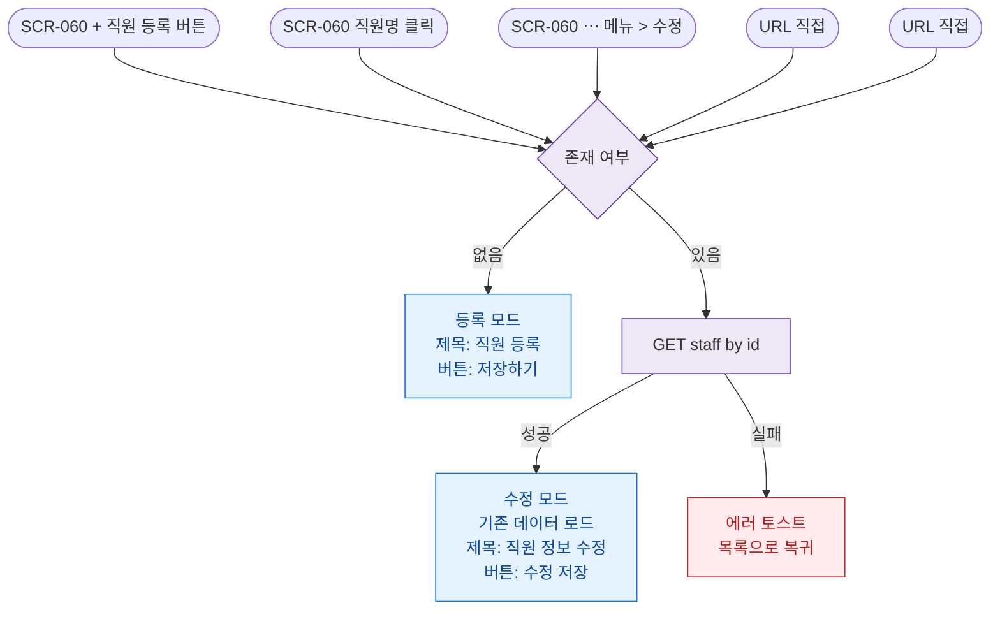

## 1. 목적

SCR-061 직원 등록/수정 화면에 진입할 수 있는 모든 경로를 명세한다.

## 2. 전제조건

- primary 로 로그인 상태이다.

## 3. 다이어그램

## 4. 엣지 설명 테이블

| 출발 | 도착 | 조건 |
|------|------|------|
| SCR-060 추가 버튼 | 모드 확인 | 없음 |
| SCR-060 직원명 | 모드 확인 | 있음 |
| 모드 확인 | 등록 모드 | 없음 |
| 모드 확인 | 데이터 조회 | 있음 |
| 데이터 조회 | 수정 모드 | 성공 |
| 데이터 조회 | 에러 | 실패 |
