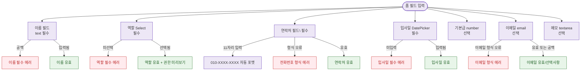

## 1. 목적

SCR-061 폼 필드별 입력 및 실시간 검증 흐름. 필터/검색이 없는 폼 화면이므로 필드 검증 플로우로 대체한다.

## 2. 다이어그램

```mermaid
flowchart TD
  FORM([폼 필드 입력])

  FORM --> FLD_NAME[이름 필드\ntext 필수]
  FORM --> FLD_ROLE[역할 Select\n필수]
  FORM --> FLD_PHONE[연락처 필드\ 필수]
  FORM --> FLD_DATE[입사일 DatePicker\n필수]
  FORM --> FLD_SALARY[기본급 number\n선택]
  FORM --> FLD_EMAIL[이메일 email\n선택]
  FORM --> FLD_MEMO[메모 textarea\n선택]

  FLD_NAME -->|공백|ERR_NAME[이름 필수 에러]
  FLD_NAME -->|입력됨|OK_NAME[이름 유효]

  FLD_ROLE -->|미선택|ERR_ROLE[역할 필수 에러]
  FLD_ROLE -->|선택됨|OK_ROLE[역할 유효 + 권한 미리보기]

  FLD_PHONE -->|11자리 입력|FMT_PHONE[010-XXXX-XXXX 자동 포맷]
  FLD_PHONE -->|형식 오류|ERR_PHONE[전화번호 형식 에러]
  FLD_PHONE -->|유효|OK_PHONE[연락처 유효]

  FLD_DATE -->|미입력|ERR_DATE[입사일 필수 에러]
  FLD_DATE -->|입력됨|OK_DATE[입사일 유효]

  FLD_EMAIL -->|이메일 형식 오류|ERR_EMAIL[이메일 형식 에러]
  FLD_EMAIL -->|유효 또는 공백|OK_EMAIL[이메일 유효/선택사항]

  classDef system fill:#EDE7F6,stroke:#5E35B2
  classDef error fill:#FFEBEE,stroke:#C62828,color:#B71C1C
  classDef success fill:#E8F5E9,stroke:#2E7D32,color:#1B5E20
  classDef info fill:#E0F7FA,stroke:#00838F

  class FORM,FLD_NAME,FLD_ROLE,FLD_PHONE,FLD_DATE,FLD_SALARY,FLD_EMAIL,FLD_MEMO,FMT_PHONE system
  class ERR_NAME,ERR_ROLE,ERR_PHONE,ERR_DATE,ERR_EMAIL error
  class OK_NAME,OK_ROLE,OK_PHONE,OK_DATE,OK_EMAIL success
```
