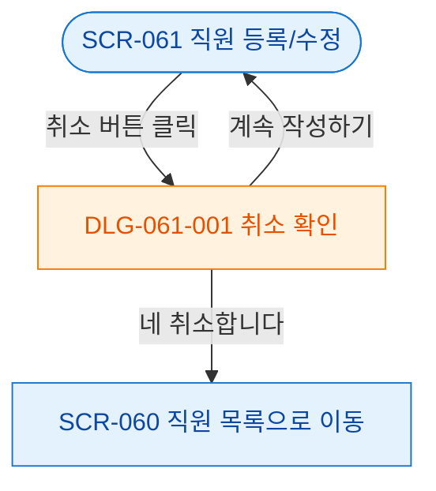

## 1. 목적

SCR-061에서 발생하는 모달 트리거 경로를 명세한다.

## 2. 다이어그램

```mermaid
flowchart TD
  SCR_061([SCR-061 직원 등록/수정])

  SCR_061 -->|취소 버튼 클릭|DLG_061_001[DLG-061-001 취소 확인]

  DLG_061_001 -->|네 취소합니다|SCR_060[SCR-060 직원 목록으로 이동]
  DLG_061_001 -->|계속 작성하기|SCR_061

  classDef screen fill:#E3F2FD,stroke:#1976D2,color:#0D47A1
  classDef modal fill:#FFF3E0,stroke:#F57C00,color:#E65100

  class SCR_061,SCR_060 screen
  class DLG_061_001 modal
```
