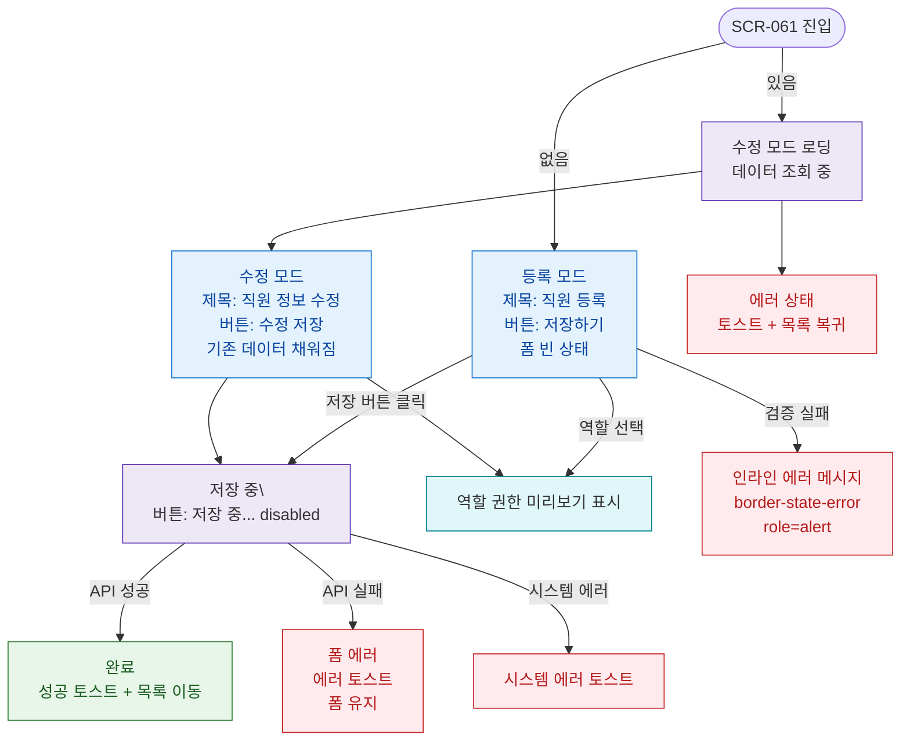

## 1. 목적

SCR-061의 등록/수정/저장중/에러 UI 상태를 명세한다.

## 2. 다이어그램

```mermaid
flowchart TD
  ENTER([SCR-061 진입])

  ENTER -->|없음|STATE_NEW[등록 모드\n제목: 직원 등록\n버튼: 저장하기\n폼 빈 상태]
  ENTER -->|있음|STATE_LOADING[수정 모드 로딩\n데이터 조회 중]

  STATE_LOADING --> STATE_EDIT[수정 모드\n제목: 직원 정보 수정\n버튼: 수정 저장\n기존 데이터 채워짐]
  STATE_LOADING --> STATE_ERR[에러 상태\n토스트 + 목록 복귀]

  STATE_NEW -->|저장 버튼 클릭|STATE_SAVING[저장 중\\n버튼: 저장 중... disabled]
  STATE_EDIT --> STATE_SAVING

  STATE_SAVING -->|API 성공|STATE_DONE[완료\n성공 토스트 + 목록 이동]
  STATE_SAVING -->|API 실패|STATE_FORM_ERR[폼 에러\n에러 토스트\n폼 유지]
  STATE_SAVING -->|시스템 에러|STATE_SYS_ERR[시스템 에러 토스트]

  STATE_NEW -->|역할 선택|STATE_ROLE_PREVIEW[역할 권한 미리보기 표시]
  STATE_EDIT --> STATE_ROLE_PREVIEW

  STATE_NEW -->|검증 실패|STATE_INLINE_ERR[인라인 에러 메시지\nborder-state-error\nrole=alert]

  classDef screen fill:#E3F2FD,stroke:#1976D2,color:#0D47A1
  classDef system fill:#EDE7F6,stroke:#5E35B2
  classDef error fill:#FFEBEE,stroke:#C62828,color:#B71C1C
  classDef success fill:#E8F5E9,stroke:#2E7D32,color:#1B5E20
  classDef info fill:#E0F7FA,stroke:#00838F
  classDef warning fill:#FFF8E1,stroke:#F9A825,color:#F57F17

  class STATE_NEW,STATE_EDIT screen
  class STATE_LOADING,STATE_SAVING system
  class STATE_ERR,STATE_FORM_ERR,STATE_SYS_ERR,STATE_INLINE_ERR error
  class STATE_DONE success
  class STATE_ROLE_PREVIEW info
```
