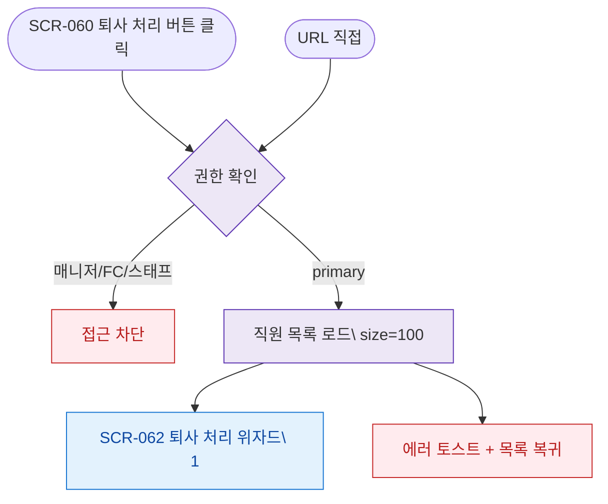

## 1. 목적

SCR-062 직원 퇴사 처리 위자드 진입 경로를 명세한다.

## 2. 전제조건

- primary 로 로그인 상태이다.

## 3. 다이어그램

```mermaid
flowchart TD
  SRC_BTN([SCR-060 퇴사 처리 버튼 클릭])
  SRC_URL([URL 직접])

  AUTH{권한 확인}

  SRC_BTN --> AUTH
  SRC_URL --> AUTH

  AUTH -->|매니저/FC/스태프|BLOCKED[접근 차단]
  AUTH -->|primary|FETCH[직원 목록 로드\ size=100]

  FETCH --> SCR_062[SCR-062 퇴사 처리 위자드\ 1]
  FETCH --> ERR[에러 토스트 + 목록 복귀]

  classDef screen fill:#E3F2FD,stroke:#1976D2,color:#0D47A1
  classDef error fill:#FFEBEE,stroke:#C62828,color:#B71C1C
  classDef rbacBlocked fill:#F5F5F5,stroke:#9E9E9E,color:#616161
  classDef system fill:#EDE7F6,stroke:#5E35B2

  class SCR_062 screen
  class BLOCKED,ERR error
  class FETCH,AUTH system
```
