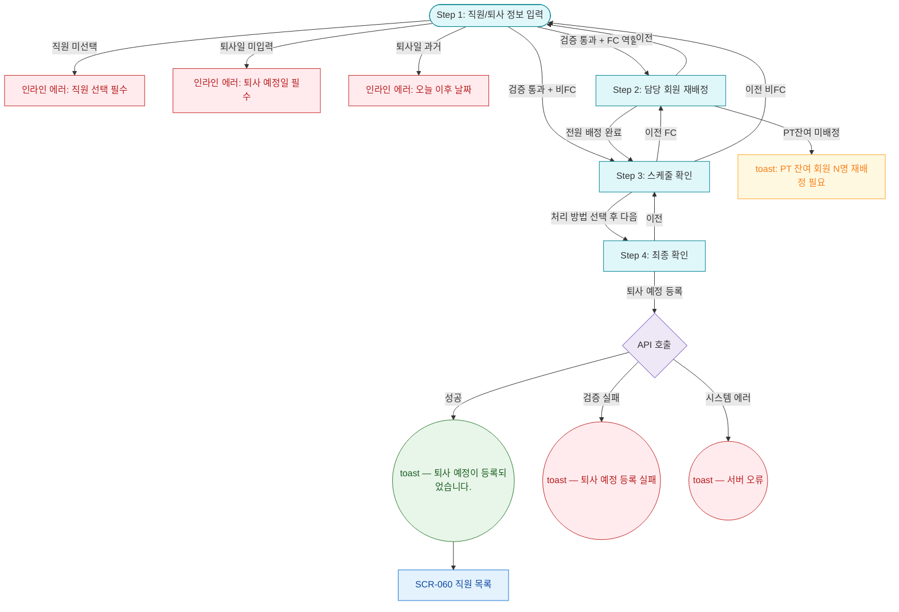

## 1. 목적

SCR-062 4단계 위자드 전체 흐름. FC/비FC 분기 포함. 성공/검증실패/시스템에러 3갈래 분기 강제.

## 2. 전제조건

- SCR-062 진입 완료, 직원 목록 로드 완료 상태이다.

## 3. 다이어그램

## 4. 엣지 설명 테이블

| 출발 | 도착 | 조건 |
|------|------|------|
| Step 1 | 에러 | 직원 미선택 |
| Step 1 | 에러 | 퇴사일 미입력 |
| Step 1 | Step 2 | 검증 통과 + FC 역할 |
| Step 1 | Step 3 | 검증 통과 + 비FC |
| Step 2 | 경고 토스트 | PT잔여 미배정 |
| Step 2 | Step 3 | 전원 배정 |
| Step 3 이전 | Step 2 | FC 역할 |
| Step 3 이전 | Step 1 | 비FC |
| API | 성공 토스트 | 성공 |
| API | 실패 토스트 | 실패 |
| API | 시스템 토스트 | 서버 오류 |
