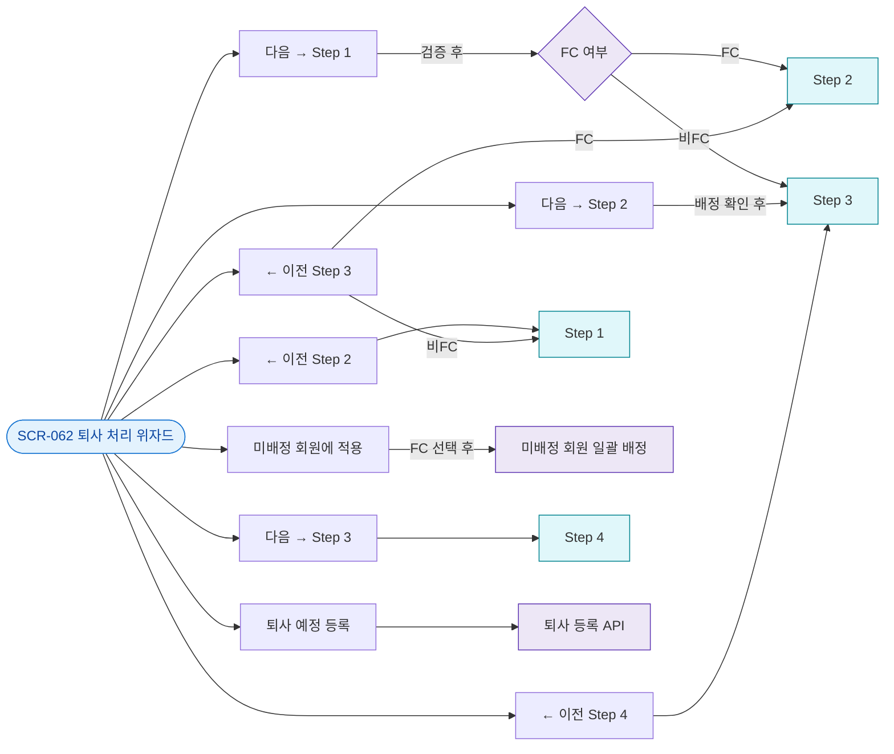

## 1. 목적

SCR-062 각 Step별 버튼 동작 명세.

## 3. 다이어그램

```mermaid
flowchart LR
  SCR_062([SCR-062 퇴사 처리 위자드])

  BTN_S1_NEXT[다음 → Step 1]
  BTN_S2_PREV[← 이전 Step 2]
  BTN_S2_NEXT[다음 → Step 2]
  BTN_S2_BULK[미배정 회원에 적용]
  BTN_S3_PREV[← 이전 Step 3]
  BTN_S3_NEXT[다음 → Step 3]
  BTN_S4_PREV[← 이전 Step 4]
  BTN_S4_SUBMIT[퇴사 예정 등록]

  SCR_062 --> BTN_S1_NEXT
  SCR_062 --> BTN_S2_PREV
  SCR_062 --> BTN_S2_NEXT
  SCR_062 --> BTN_S2_BULK
  SCR_062 --> BTN_S3_PREV
  SCR_062 --> BTN_S3_NEXT
  SCR_062 --> BTN_S4_PREV
  SCR_062 --> BTN_S4_SUBMIT

  BTN_S1_NEXT -->|검증 후|NEXT_CHECK{FC 여부}
  NEXT_CHECK -->|FC|STEP2[Step 2]
  NEXT_CHECK -->|비FC|STEP3[Step 3]

  BTN_S2_PREV --> STEP1[Step 1]
  BTN_S2_NEXT -->|배정 확인 후|STEP3
  BTN_S2_BULK -->|FC 선택 후|BULK_ASSIGN[미배정 회원 일괄 배정]

  BTN_S3_PREV -->|FC|STEP2
  BTN_S3_PREV -->|비FC|STEP1
  BTN_S3_NEXT --> STEP4[Step 4]

  BTN_S4_PREV --> STEP3
  BTN_S4_SUBMIT --> SUBMIT_API[퇴사 등록 API]

  classDef screen fill:#E3F2FD,stroke:#1976D2,color:#0D47A1
  classDef system fill:#EDE7F6,stroke:#5E35B2
  classDef info fill:#E0F7FA,stroke:#00838F

  class SCR_062 screen
  class NEXT_CHECK,SUBMIT_API,BULK_ASSIGN system
  class STEP1,STEP2,STEP3,STEP4 info
```
