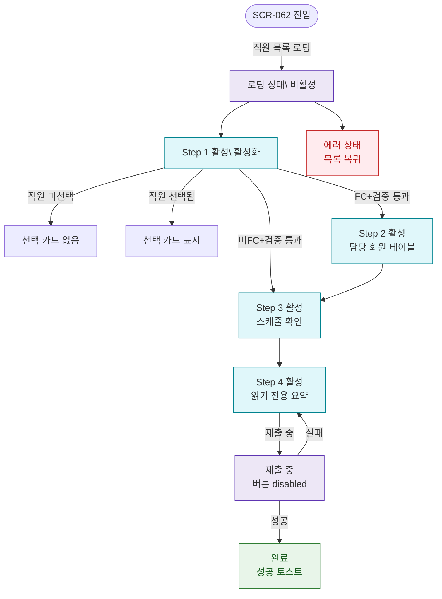

## 1. 목적

SCR-062 위자드 Step별 UI 상태를 명세한다.

## 3. 다이어그램

```mermaid
flowchart TD
  ENTER([SCR-062 진입])

  ENTER -->|직원 목록 로딩|STATE_LOADING[로딩 상태\ 비활성]
  STATE_LOADING --> STATE_STEP1[Step 1 활성\ 활성화]
  STATE_LOADING --> STATE_ERR[에러 상태\n목록 복귀]

  STATE_STEP1 -->|직원 미선택|STATE_NO_CARD[선택 카드 없음]
  STATE_STEP1 -->|직원 선택됨|STATE_CARD[선택 카드 표시]

  STATE_STEP1 -->|FC+검증 통과|STATE_STEP2[Step 2 활성\n담당 회원 테이블]
  STATE_STEP1 -->|비FC+검증 통과|STATE_STEP3[Step 3 활성\n스케줄 확인]

  STATE_STEP2 --> STATE_STEP3
  STATE_STEP3 --> STATE_STEP4[Step 4 활성\n읽기 전용 요약]

  STATE_STEP4 -->|제출 중|STATE_SUBMITTING[제출 중\n버튼 disabled]
  STATE_SUBMITTING -->|성공|STATE_DONE[완료\n성공 토스트]
  STATE_SUBMITTING -->|실패|STATE_STEP4

  classDef screen fill:#E3F2FD,stroke:#1976D2,color:#0D47A1
  classDef system fill:#EDE7F6,stroke:#5E35B2
  classDef error fill:#FFEBEE,stroke:#C62828,color:#B71C1C
  classDef success fill:#E8F5E9,stroke:#2E7D32,color:#1B5E20
  classDef info fill:#E0F7FA,stroke:#00838F

  class STATE_DONE success
  class STATE_LOADING,STATE_SUBMITTING system
  class STATE_ERR error
  class STATE_STEP1,STATE_STEP2,STATE_STEP3,STATE_STEP4 info
```
