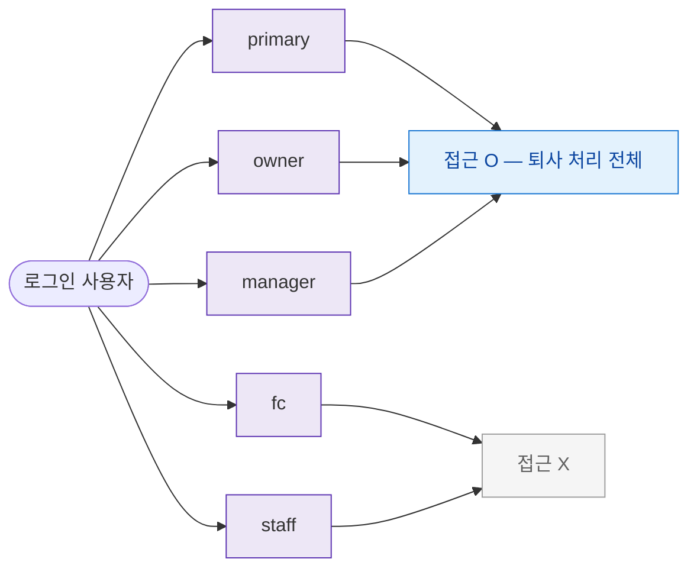

## 1. 목적

SCR-062 역할별 접근 분기를 명세한다.

## 3. 다이어그램

```mermaid
flowchart LR
  USER([로그인 사용자])

  USER --> R_PRIMARY[primary]
  USER --> R_OWNER[owner]
  USER --> R_MANAGER[manager]
  USER --> R_FC[fc]
  USER --> R_STAFF[staff]

  R_PRIMARY --> ACCESS[접근 O — 퇴사 처리 전체]
  R_OWNER --> ACCESS
  R_MANAGER --> ACCESS

  R_FC --> BLOCKED[접근 X]
  R_STAFF --> BLOCKED

  classDef screen fill:#E3F2FD,stroke:#1976D2,color:#0D47A1
  classDef rbacBlocked fill:#F5F5F5,stroke:#9E9E9E,color:#616161
  classDef system fill:#EDE7F6,stroke:#5E35B2

  class ACCESS screen
  class BLOCKED rbacBlocked
  class R_PRIMARY,R_OWNER,R_MANAGER,R_FC,R_STAFF system
```
