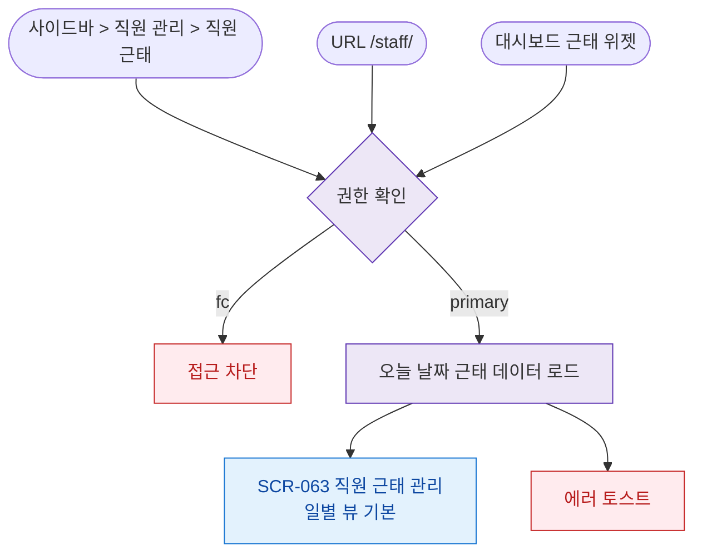

## 1. 목적

SCR-063 직원 근태 관리 화면 진입 경로를 명세한다.

## 3. 다이어그램

```mermaid
flowchart TD
  SRC_SIDEBAR([사이드바 > 직원 관리 > 직원 근태])
  SRC_URL([URL /staff/])
  SRC_DASH([대시보드 근태 위젯])

  AUTH{권한 확인}
  SRC_SIDEBAR --> AUTH
  SRC_URL --> AUTH
  SRC_DASH --> AUTH

  AUTH -->|fc|BLOCKED[접근 차단]
  AUTH -->|primary|LOAD[오늘 날짜 근태 데이터 로드]

  LOAD --> SCR_063[SCR-063 직원 근태 관리\n일별 뷰 기본]
  LOAD --> ERR[에러 토스트]

  classDef screen fill:#E3F2FD,stroke:#1976D2,color:#0D47A1
  classDef error fill:#FFEBEE,stroke:#C62828,color:#B71C1C
  classDef rbacBlocked fill:#F5F5F5,stroke:#9E9E9E,color:#616161
  classDef system fill:#EDE7F6,stroke:#5E35B2

  class SCR_063 screen
  class BLOCKED,ERR error
  class LOAD,AUTH system
```
