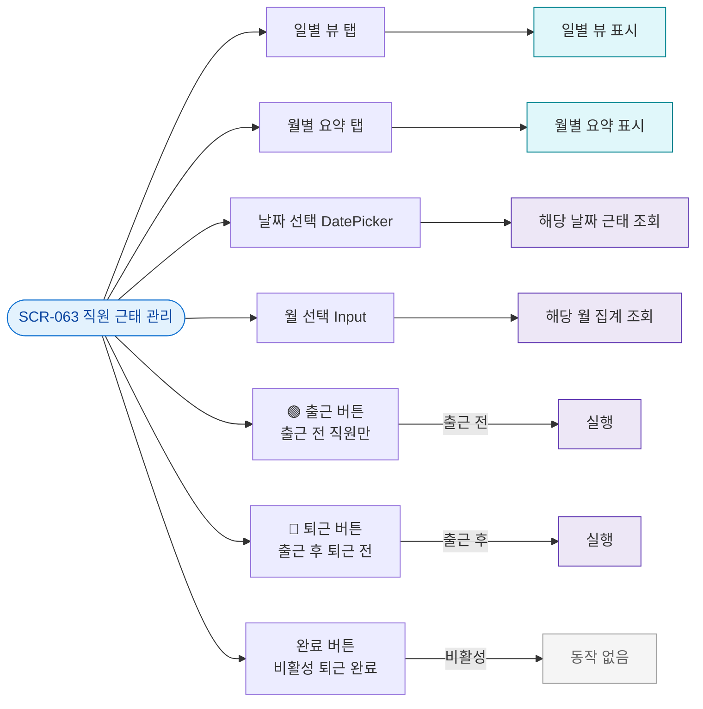

## 1. 목적

SCR-063의 모든 버튼 동작 명세.

## 3. 다이어그램

```mermaid
flowchart LR
  SCR_063([SCR-063 직원 근태 관리])

  TAB_DAILY[일별 뷰 탭]
  TAB_MONTHLY[월별 요약 탭]
  BTN_DATE[날짜 선택 DatePicker]
  BTN_MONTH[월 선택 Input]
  BTN_CLOCKIN[🟢 출근 버튼\n출근 전 직원만]
  BTN_CLOCKOUT[🔵 퇴근 버튼\n출근 후 퇴근 전]
  BTN_DONE[완료 버튼\n비활성 퇴근 완료]

  SCR_063 --> TAB_DAILY
  SCR_063 --> TAB_MONTHLY
  SCR_063 --> BTN_DATE
  SCR_063 --> BTN_MONTH
  SCR_063 --> BTN_CLOCKIN
  SCR_063 --> BTN_CLOCKOUT
  SCR_063 --> BTN_DONE

  TAB_DAILY --> SHOW_DAILY[일별 뷰 표시]
  TAB_MONTHLY --> SHOW_MONTHLY[월별 요약 표시]
  BTN_DATE --> LOAD_DATE[해당 날짜 근태 조회]
  BTN_MONTH --> LOAD_MONTH[해당 월 집계 조회]
  BTN_CLOCKIN -->|출근 전|CLOCKIN[실행]
  BTN_CLOCKOUT -->|출근 후|CLOCKOUT[실행]
  BTN_DONE -->|비활성|NOOP[동작 없음]

  classDef screen fill:#E3F2FD,stroke:#1976D2,color:#0D47A1
  classDef system fill:#EDE7F6,stroke:#5E35B2
  classDef rbacBlocked fill:#F5F5F5,stroke:#9E9E9E,color:#616161
  classDef info fill:#E0F7FA,stroke:#00838F

  class SCR_063 screen
  class CLOCKIN,CLOCKOUT,LOAD_DATE,LOAD_MONTH system
  class SHOW_DAILY,SHOW_MONTHLY info
  class NOOP rbacBlocked
```
