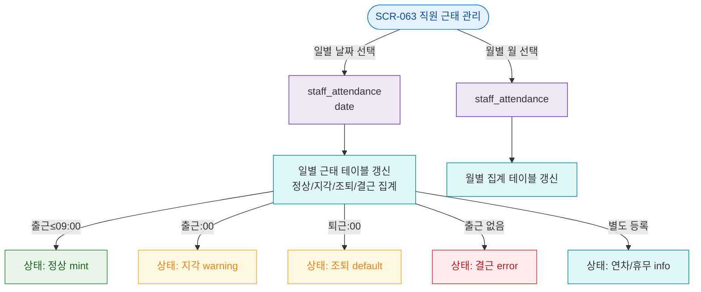

## 1. 목적

SCR-063의 날짜/월 선택 및 근태 상태 필터 흐름을 명세한다.

## 3. 다이어그램

```mermaid
flowchart TD
  SCR_063([SCR-063 직원 근태 관리])

  SCR_063 -->|일별 날짜 선택|DATE_QUERY[staff_attendance\n date]
  DATE_QUERY --> DAILY_TABLE[일별 근태 테이블 갱신\n정상/지각/조퇴/결근 집계]

  SCR_063 -->|월별 월 선택|MONTH_QUERY[staff_attendance\n]
  MONTH_QUERY --> MONTHLY_TABLE[월별 집계 테이블 갱신]

  DAILY_TABLE -->|"출근≤09:00"|STATUS_NORMAL[상태: 정상 mint]
  DAILY_TABLE -->|"출근:00"|STATUS_LATE[상태: 지각 warning]
  DAILY_TABLE -->|"퇴근:00"|STATUS_EARLY[상태: 조퇴 default]
  DAILY_TABLE -->|출근 없음|STATUS_ABSENT[상태: 결근 error]
  DAILY_TABLE -->|별도 등록|STATUS_LEAVE[상태: 연차/휴무 info]

  classDef screen fill:#E3F2FD,stroke:#1976D2,color:#0D47A1
  classDef success fill:#E8F5E9,stroke:#2E7D32,color:#1B5E20
  classDef warning fill:#FFF8E1,stroke:#F9A825,color:#F57F17
  classDef error fill:#FFEBEE,stroke:#C62828,color:#B71C1C
  classDef info fill:#E0F7FA,stroke:#00838F
  classDef system fill:#EDE7F6,stroke:#5E35B2

  class SCR_063 screen
  class DATE_QUERY,MONTH_QUERY system
  class DAILY_TABLE,MONTHLY_TABLE info
  class STATUS_NORMAL success
  class STATUS_LATE,STATUS_EARLY warning
  class STATUS_ABSENT error
  class STATUS_LEAVE info
```
