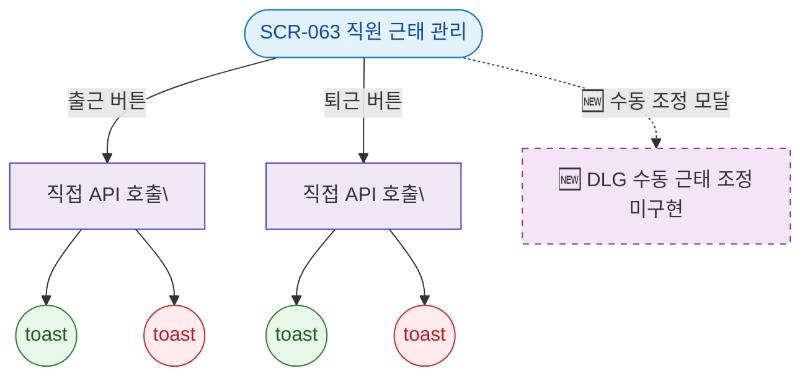

## 1. 목적

SCR-063은 인라인 액션 기반으로 별도 모달 없음. 출퇴근 버튼이 직접 API 호출. 향후 수동 조정 모달 추가 예정(🆕).

## 3. 다이어그램

```mermaid
flowchart TD
  SCR_063([SCR-063 직원 근태 관리])

  SCR_063 -->|출근 버튼|CLOCKIN_API[직접 API 호출\]
  SCR_063 -->|퇴근 버튼|CLOCKOUT_API[직접 API 호출\]

  CLOCKIN_API --> TOAST_OK((toast))
  CLOCKIN_API --> TOAST_ERR((toast))

  CLOCKOUT_API --> TOAST_OK2((toast))
  CLOCKOUT_API --> TOAST_ERR2((toast))

  SCR_063 -.->|🆕 수동 조정 모달|DLG_MANUAL[🆕 DLG 수동 근태 조정\n미구현]

  classDef screen fill:#E3F2FD,stroke:#1976D2,color:#0D47A1
  classDef system fill:#EDE7F6,stroke:#5E35B2
  classDef success fill:#E8F5E9,stroke:#2E7D32,color:#1B5E20
  classDef error fill:#FFEBEE,stroke:#C62828,color:#B71C1C
  classDef newFeature fill:#F3E5F5,stroke:#9C27B0,stroke-dasharray:5 5

  class SCR_063 screen
  class CLOCKIN_API,CLOCKOUT_API system
  class TOAST_OK,TOAST_OK2 success
  class TOAST_ERR,TOAST_ERR2 error
  class DLG_MANUAL newFeature
```
