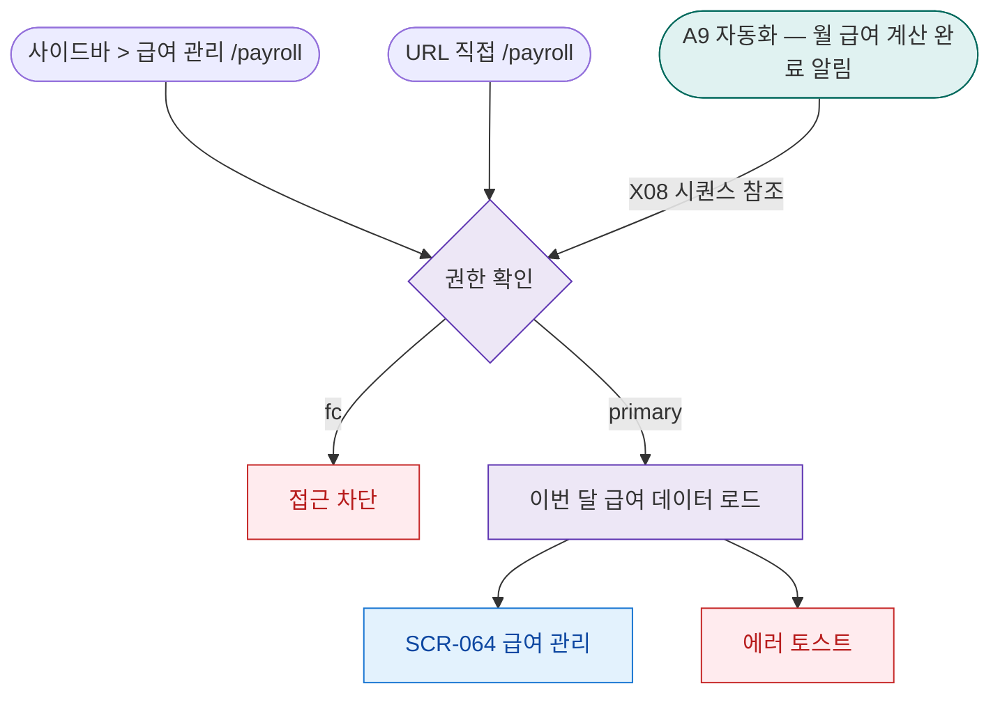

## 1. 목적

SCR-064 급여 관리 화면 진입 경로를 명세한다. 급여 확정은 owner/primary만 가능.

## 3. 다이어그램

```mermaid
flowchart TD
  SRC_SIDEBAR([사이드바 > 급여 관리 /payroll])
  SRC_URL([URL 직접 /payroll])
  SRC_A9([A9 자동화 — 월 급여 계산 완료 알림])

  AUTH{권한 확인}
  SRC_SIDEBAR --> AUTH
  SRC_URL --> AUTH
  SRC_A9 -->|X08 시퀀스 참조|AUTH

  AUTH -->|fc|BLOCKED[접근 차단]
  AUTH -->|primary|LOAD[이번 달 급여 데이터 로드]

  LOAD --> SCR_064[SCR-064 급여 관리]
  LOAD --> ERR[에러 토스트]

  classDef screen fill:#E3F2FD,stroke:#1976D2,color:#0D47A1
  classDef error fill:#FFEBEE,stroke:#C62828,color:#B71C1C
  classDef rbacBlocked fill:#F5F5F5,stroke:#9E9E9E,color:#616161
  classDef system fill:#EDE7F6,stroke:#5E35B2
  classDef cron fill:#E0F2F1,stroke:#00695C

  class SCR_064 screen
  class BLOCKED,ERR error
  class LOAD,AUTH system
  class SRC_A9 cron
```
