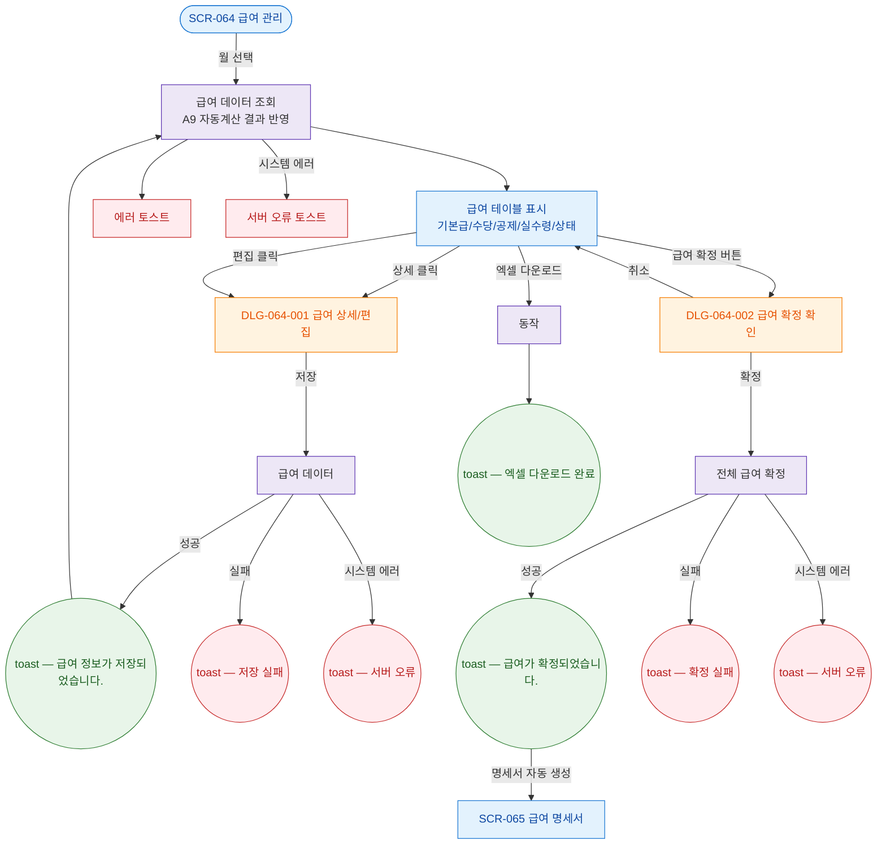

## 1. 목적

SCR-064 급여 조회→개별 편집→전체 확정 흐름. A9 자동계산 연결. X08 시퀀스 참조. 성공/검증실패/시스템에러 3갈래 분기 강제.

## 3. 다이어그램

```mermaid
flowchart TD
  SCR_064([SCR-064 급여 관리])

  SCR_064 -->|월 선택|LOAD_API[급여 데이터 조회\nA9 자동계산 결과 반영]
  LOAD_API --> TABLE[급여 테이블 표시\n기본급/수당/공제/실수령/상태]
  LOAD_API --> ERR_LOAD[에러 토스트]
  LOAD_API -->|시스템 에러|ERR_SYS[서버 오류 토스트]

  TABLE -->|상세 클릭|DLG_064_001[DLG-064-001 급여 상세/편집]
  TABLE -->|편집 클릭|DLG_064_001

  DLG_064_001 -->|저장|SAVE_API[급여 데이터]
  SAVE_API -->|성공|TOAST_SAVE_OK((toast — 급여 정보가 저장되었습니다.))
  SAVE_API -->|실패|TOAST_SAVE_ERR((toast — 저장 실패))
  SAVE_API -->|시스템 에러|TOAST_SYS((toast — 서버 오류))
  TOAST_SAVE_OK --> LOAD_API

  TABLE -->|급여 확정 버튼|DLG_064_002[DLG-064-002 급여 확정 확인]
  DLG_064_002 -->|취소|TABLE
  DLG_064_002 -->|확정|CONFIRM_API[전체 급여 확정]
  CONFIRM_API -->|성공|TOAST_CONFIRM_OK((toast — 급여가 확정되었습니다.))
  CONFIRM_API -->|실패|TOAST_CONFIRM_ERR((toast — 확정 실패))
  CONFIRM_API -->|시스템 에러|TOAST_SYS2((toast — 서버 오류))
  TOAST_CONFIRM_OK -->|명세서 자동 생성|SCR_065[SCR-065 급여 명세서]

  TABLE -->|엑셀 다운로드|EXPORT[동작]
  EXPORT --> TOAST_EXPORT_OK((toast — 엑셀 다운로드 완료))

  classDef screen fill:#E3F2FD,stroke:#1976D2,color:#0D47A1
  classDef modal fill:#FFF3E0,stroke:#F57C00,color:#E65100
  classDef success fill:#E8F5E9,stroke:#2E7D32,color:#1B5E20
  classDef error fill:#FFEBEE,stroke:#C62828,color:#B71C1C
  classDef system fill:#EDE7F6,stroke:#5E35B2

  class SCR_064,SCR_065,TABLE screen
  class DLG_064_001,DLG_064_002 modal
  class TOAST_SAVE_OK,TOAST_CONFIRM_OK,TOAST_EXPORT_OK success
  class ERR_LOAD,ERR_SYS,TOAST_SAVE_ERR,TOAST_SYS,TOAST_CONFIRM_ERR,TOAST_SYS2 error
  class LOAD_API,SAVE_API,CONFIRM_API,EXPORT system
```
