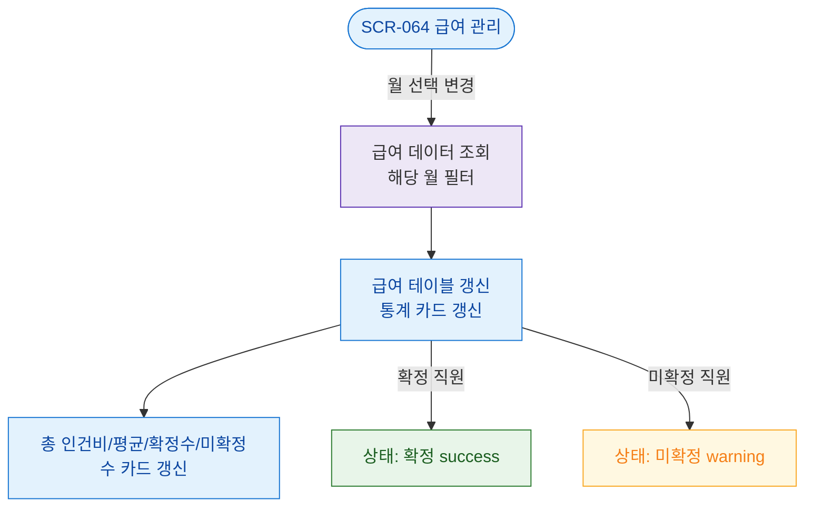

## 3. 다이어그램

```mermaid
flowchart TD
  SCR_064([SCR-064 급여 관리])

  SCR_064 -->|월 선택 변경|MONTH_QUERY[급여 데이터 조회\n해당 월 필터]
  MONTH_QUERY --> TABLE[급여 테이블 갱신\n통계 카드 갱신]

  TABLE --> STAT[총 인건비/평균/확정수/미확정수 카드 갱신]

  TABLE -->|확정 직원|STATUS_CONFIRMED[상태: 확정 success]
  TABLE -->|미확정 직원|STATUS_PENDING[상태: 미확정 warning]

  classDef screen fill:#E3F2FD,stroke:#1976D2,color:#0D47A1
  classDef success fill:#E8F5E9,stroke:#2E7D32,color:#1B5E20
  classDef warning fill:#FFF8E1,stroke:#F9A825,color:#F57F17
  classDef system fill:#EDE7F6,stroke:#5E35B2

  class SCR_064 screen
  class MONTH_QUERY system
  class TABLE,STAT screen
  class STATUS_CONFIRMED success
  class STATUS_PENDING warning
```
