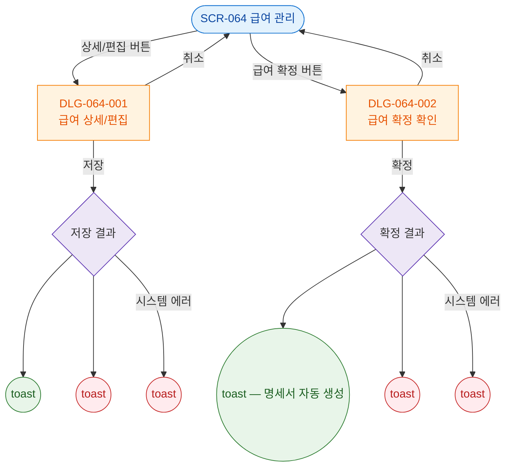

## 3. 다이어그램

```mermaid
flowchart TD
  SCR_064([SCR-064 급여 관리])

  SCR_064 -->|상세/편집 버튼|DLG_064_001[DLG-064-001\n급여 상세/편집]
  SCR_064 -->|급여 확정 버튼|DLG_064_002[DLG-064-002\n급여 확정 확인]

  DLG_064_001 -->|취소|SCR_064
  DLG_064_001 -->|저장|SAVE_RESULT{저장 결과}
  SAVE_RESULT --> TOAST_OK((toast))
  SAVE_RESULT --> TOAST_ERR((toast))
  SAVE_RESULT -->|시스템 에러|TOAST_SYS((toast))

  DLG_064_002 -->|취소|SCR_064
  DLG_064_002 -->|확정|CONFIRM_RESULT{확정 결과}
  CONFIRM_RESULT --> TOAST_CONFIRM_OK((toast — 명세서 자동 생성))
  CONFIRM_RESULT --> TOAST_CONFIRM_ERR((toast))
  CONFIRM_RESULT -->|시스템 에러|TOAST_SYS2((toast))

  classDef screen fill:#E3F2FD,stroke:#1976D2,color:#0D47A1
  classDef modal fill:#FFF3E0,stroke:#F57C00,color:#E65100
  classDef success fill:#E8F5E9,stroke:#2E7D32,color:#1B5E20
  classDef error fill:#FFEBEE,stroke:#C62828,color:#B71C1C
  classDef system fill:#EDE7F6,stroke:#5E35B2

  class SCR_064 screen
  class DLG_064_001,DLG_064_002 modal
  class TOAST_OK,TOAST_CONFIRM_OK success
  class TOAST_ERR,TOAST_SYS,TOAST_CONFIRM_ERR,TOAST_SYS2 error
  class SAVE_RESULT,CONFIRM_RESULT system
```
